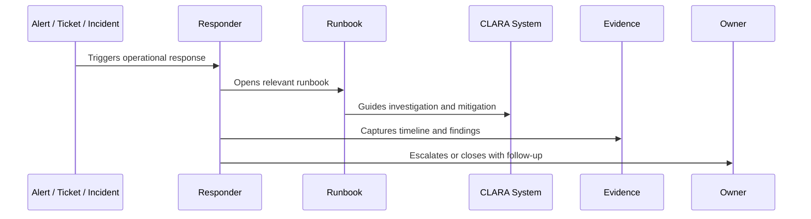

# Part 09 Summary

> *"Summarizes Runbooks and Playbooks and prepares for Book VII Part 10."*

---

# Purpose

Summarizes Runbooks and Playbooks and prepares for Book VII Part 10.

---

# Operational Problem

SLOs and error budgets come next because runbooks define response actions while SLOs define reliability expectations and acceptable risk.

---

# Operational Decision

## Decision

CLARA should proceed to SLOs, SLIs, and Error Budgets after defining runbook architecture, templates, service runbooks, AI runbooks, integration runbooks, database/queue runbooks, support playbooks, recovery playbooks, and review cadence.

## Status

Accepted.

---

# Runbook Rule

Every critical CLARA operational procedure must be documented as:

```text
Trigger -> Owner -> Symptoms -> Investigation -> Mitigation -> Escalation -> Evidence -> Follow-Up -> Review
```

A runbook is incomplete if the responder cannot answer:

```text
when to use it
what to check first
what is safe to do
what is dangerous to do
who to escalate to
what evidence to collect
how to confirm recovery
what to update after recovery
```

---

# Recommended Runbook Flow



---

# Production-Ready Checklist

- [ ] Trigger is clear.
- [ ] Owner is clear.
- [ ] Required permissions are clear.
- [ ] Dashboards/logs/metrics are linked.
- [ ] Diagnosis steps are actionable.
- [ ] Mitigation steps are safe.
- [ ] Escalation path is defined.
- [ ] Evidence capture is defined.
- [ ] Customer/support communication note exists where needed.
- [ ] Last reviewed date is documented.

---

# Acceptance Criteria

- [ ] Procedure is repeatable.
- [ ] Safety boundaries are clear.
- [ ] Security/privacy warnings are explicit.
- [ ] Evidence expectations are clear.
- [ ] Escalation path is clear.
- [ ] Review cadence exists.
- [ ] AI coding assistants can follow this safely.

---

# Anti-patterns

Avoid:

- Runbooks that only say “ask senior engineer.”
- Missing owner.
- Missing last reviewed date.
- Commands with no explanation or safety warning.
- Destructive recovery steps without approval.
- Customer data exposure in screenshots/log examples.
- No rollback or stop condition.
- No validation step after mitigation.
- Incident playbooks without communication rules.
- Runbooks that are not updated after incidents.

---

# Related Documents

- ../PART-08-Production-Support-Operations/README.md
- ../PART-07-Backup-Restore-and-Disaster-Recovery/README.md
- ../PART-04-Alerting-and-Incident-Operations/README.md
- ../PART-03-Logging-and-Metrics/README.md
- ../../BOOK-06-Security-Governance-and-Compliance/PART-08-Incident-Response-and-Business-Continuity-Governance/README.md

---

# Navigation

**Previous:** `107-Runbook-Review-Cadence-and-Quality-Checklist.md`

**Next:** `../PART-10-SLOs-SLIs-and-Error-Budgets/README.md`

---

# Part 09 Completion

Part 09 establishes:

- Runbooks and playbooks overview.
- Runbook architecture and ownership.
- Runbook template standard.
- Incident playbook template standard.
- Service runbooks.
- AI operations runbooks.
- Integration and webhook runbooks.
- Database, queue, and worker runbooks.
- Support playbooks.
- Recovery and DR playbooks.
- Runbook review cadence and quality checklist.

---

# Ready for Part 10

The next part should be:

```text
BOOK VII — PART 10: SLOs, SLIs, and Error Budgets
```

It should define:

- SLO principles.
- SLI selection.
- Critical journey SLOs.
- Availability SLOs.
- Latency SLOs.
- Error budget model.
- Alerting from SLOs.
- Error budget policy.
- SLO reporting.
- Reliability decision-making with SLOs.
