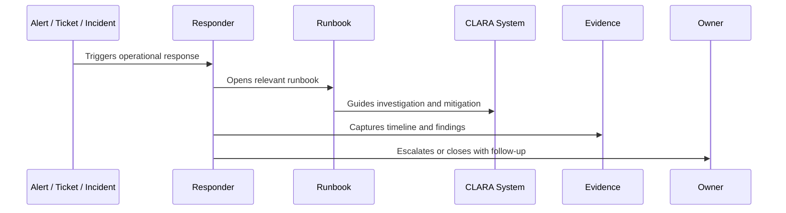

# Runbooks and Playbooks Overview

> *"Introduces CLARA's runbook and playbook model for making production operations, incident response, support escalation, recovery, and troubleshooting repeatable."*

---

# Purpose

Introduces CLARA's runbook and playbook model for making production operations, incident response, support escalation, recovery, and troubleshooting repeatable.

---

# Operational Problem

Production response becomes slow and risky when teams rely on memory instead of tested operational procedures.

---

# Operational Decision

## Decision

CLARA should maintain runbooks and playbooks as living operational assets owned by teams and reviewed after incidents, releases, and major changes.

## Status

Accepted.

---

# Runbook Rule

Every critical CLARA operational procedure must be documented as:

```text
Trigger -> Owner -> Symptoms -> Investigation -> Mitigation -> Escalation -> Evidence -> Follow-Up -> Review
```

A runbook is incomplete if the responder cannot answer:

```text
when to use it
what to check first
what is safe to do
what is dangerous to do
who to escalate to
what evidence to collect
how to confirm recovery
what to update after recovery
```

---

# Recommended Runbook Flow



---

# Production-Ready Checklist

- [ ] Trigger is clear.
- [ ] Owner is clear.
- [ ] Required permissions are clear.
- [ ] Dashboards/logs/metrics are linked.
- [ ] Diagnosis steps are actionable.
- [ ] Mitigation steps are safe.
- [ ] Escalation path is defined.
- [ ] Evidence capture is defined.
- [ ] Customer/support communication note exists where needed.
- [ ] Last reviewed date is documented.

---

# Acceptance Criteria

- [ ] Procedure is repeatable.
- [ ] Safety boundaries are clear.
- [ ] Security/privacy warnings are explicit.
- [ ] Evidence expectations are clear.
- [ ] Escalation path is clear.
- [ ] Review cadence exists.
- [ ] AI coding assistants can follow this safely.

---

# Anti-patterns

Avoid:

- Runbooks that only say “ask senior engineer.”
- Missing owner.
- Missing last reviewed date.
- Commands with no explanation or safety warning.
- Destructive recovery steps without approval.
- Customer data exposure in screenshots/log examples.
- No rollback or stop condition.
- No validation step after mitigation.
- Incident playbooks without communication rules.
- Runbooks that are not updated after incidents.

---

# Related Documents

- ../PART-08-Production-Support-Operations/README.md
- ../PART-07-Backup-Restore-and-Disaster-Recovery/README.md
- ../PART-04-Alerting-and-Incident-Operations/README.md
- ../PART-03-Logging-and-Metrics/README.md
- ../../BOOK-06-Security-Governance-and-Compliance/PART-08-Incident-Response-and-Business-Continuity-Governance/README.md

---

# Navigation

**Previous:** `../PART-08-Production-Support-Operations/96-Part-08-Summary.md`

**Next:** `98-Runbook-Architecture-and-Ownership.md`

---

# Scope

CLARA runbooks and playbooks cover:

```text
service operations
incident response
AI operations
integration/webhook operations
database operations
queue/worker operations
production support
backup/restore/DR
deployment recovery
known issue handling
customer communication support
```

---

# Runbook vs Playbook

```text
Runbook = step-by-step procedure for known operational task or system issue.
Playbook = coordinated response for broader scenario involving people, communication, and decisions.
```

---

# Core Question

```text
Can someone who did not build this system operate it safely under pressure?
```
