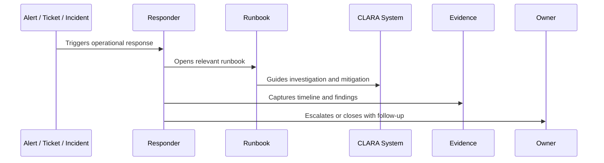

# Runbook Architecture and Ownership

> *"Defines how CLARA organizes runbooks by service, workflow, dependency, incident type, support process, and recovery scenario."*

---

# Purpose

Defines how CLARA organizes runbooks by service, workflow, dependency, incident type, support process, and recovery scenario.

---

# Operational Problem

Runbooks become stale quickly when ownership and structure are unclear.

---

# Operational Decision

## Decision

CLARA runbooks should have owners, version history, review cadence, linked dashboards, linked alerts, and clear operational scope.

## Status

Accepted.

---

# Runbook Rule

Every critical CLARA operational procedure must be documented as:

```text
Trigger -> Owner -> Symptoms -> Investigation -> Mitigation -> Escalation -> Evidence -> Follow-Up -> Review
```

A runbook is incomplete if the responder cannot answer:

```text
when to use it
what to check first
what is safe to do
what is dangerous to do
who to escalate to
what evidence to collect
how to confirm recovery
what to update after recovery
```

---

# Recommended Runbook Flow



---

# Production-Ready Checklist

- [ ] Trigger is clear.
- [ ] Owner is clear.
- [ ] Required permissions are clear.
- [ ] Dashboards/logs/metrics are linked.
- [ ] Diagnosis steps are actionable.
- [ ] Mitigation steps are safe.
- [ ] Escalation path is defined.
- [ ] Evidence capture is defined.
- [ ] Customer/support communication note exists where needed.
- [ ] Last reviewed date is documented.

---

# Acceptance Criteria

- [ ] Procedure is repeatable.
- [ ] Safety boundaries are clear.
- [ ] Security/privacy warnings are explicit.
- [ ] Evidence expectations are clear.
- [ ] Escalation path is clear.
- [ ] Review cadence exists.
- [ ] AI coding assistants can follow this safely.

---

# Anti-patterns

Avoid:

- Runbooks that only say “ask senior engineer.”
- Missing owner.
- Missing last reviewed date.
- Commands with no explanation or safety warning.
- Destructive recovery steps without approval.
- Customer data exposure in screenshots/log examples.
- No rollback or stop condition.
- No validation step after mitigation.
- Incident playbooks without communication rules.
- Runbooks that are not updated after incidents.

---

# Related Documents

- ../PART-08-Production-Support-Operations/README.md
- ../PART-07-Backup-Restore-and-Disaster-Recovery/README.md
- ../PART-04-Alerting-and-Incident-Operations/README.md
- ../PART-03-Logging-and-Metrics/README.md
- ../../BOOK-06-Security-Governance-and-Compliance/PART-08-Incident-Response-and-Business-Continuity-Governance/README.md

---

# Navigation

**Previous:** `97-Runbooks-and-Playbooks-Overview.md`

**Next:** `99-Runbook-Template-Standard.md`

---

# Runbook Repository Structure

Recommended structure:

```text
runbooks/
├── services/
├── incidents/
├── ai/
├── integrations/
├── database/
├── queues-workers/
├── support/
├── recovery-dr/
├── deployments/
└── templates/
```

---

# Ownership Fields

Each runbook should define:

```text
owner
backup owner
reviewer
last reviewed
review cadence
related alerts
related dashboards
related services
related support workflows
```

---

# Ownership Rule

No critical alert, service, or support process should exist without an owned runbook.
