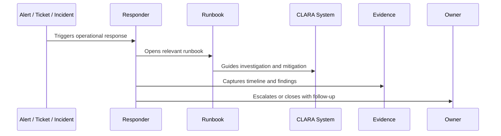

# Runbook Template Standard

> *"Defines the standard template every CLARA runbook should follow."*

---

# Purpose

Defines the standard template every CLARA runbook should follow.

---

# Operational Problem

A runbook that is too vague cannot help responders during incidents.

---

# Operational Decision

## Decision

CLARA runbooks should be written as practical step-by-step instructions that responders can follow during pressure.

## Status

Accepted.

---

# Runbook Rule

Every critical CLARA operational procedure must be documented as:

```text
Trigger -> Owner -> Symptoms -> Investigation -> Mitigation -> Escalation -> Evidence -> Follow-Up -> Review
```

A runbook is incomplete if the responder cannot answer:

```text
when to use it
what to check first
what is safe to do
what is dangerous to do
who to escalate to
what evidence to collect
how to confirm recovery
what to update after recovery
```

---

# Recommended Runbook Flow



---

# Production-Ready Checklist

- [ ] Trigger is clear.
- [ ] Owner is clear.
- [ ] Required permissions are clear.
- [ ] Dashboards/logs/metrics are linked.
- [ ] Diagnosis steps are actionable.
- [ ] Mitigation steps are safe.
- [ ] Escalation path is defined.
- [ ] Evidence capture is defined.
- [ ] Customer/support communication note exists where needed.
- [ ] Last reviewed date is documented.

---

# Acceptance Criteria

- [ ] Procedure is repeatable.
- [ ] Safety boundaries are clear.
- [ ] Security/privacy warnings are explicit.
- [ ] Evidence expectations are clear.
- [ ] Escalation path is clear.
- [ ] Review cadence exists.
- [ ] AI coding assistants can follow this safely.

---

# Anti-patterns

Avoid:

- Runbooks that only say “ask senior engineer.”
- Missing owner.
- Missing last reviewed date.
- Commands with no explanation or safety warning.
- Destructive recovery steps without approval.
- Customer data exposure in screenshots/log examples.
- No rollback or stop condition.
- No validation step after mitigation.
- Incident playbooks without communication rules.
- Runbooks that are not updated after incidents.

---

# Related Documents

- ../PART-08-Production-Support-Operations/README.md
- ../PART-07-Backup-Restore-and-Disaster-Recovery/README.md
- ../PART-04-Alerting-and-Incident-Operations/README.md
- ../PART-03-Logging-and-Metrics/README.md
- ../../BOOK-06-Security-Governance-and-Compliance/PART-08-Incident-Response-and-Business-Continuity-Governance/README.md

---

# Navigation

**Previous:** `98-Runbook-Architecture-and-Ownership.md`

**Next:** `100-Incident-Playbook-Template-Standard.md`

---

# Standard Runbook Template

```markdown
# Runbook: <Name>

## Purpose
What this runbook helps with.

## Trigger
When to use it.

## Owner
Primary and backup owner.

## Severity
Expected severity range.

## Symptoms
What responders may observe.

## Dashboards and Logs
Links/queries.

## Required Access
Permissions needed.

## Safety Warnings
Dangerous actions and boundaries.

## Diagnosis Steps
Step-by-step investigation.

## Mitigation Steps
Safe recovery actions.

## Escalation
Who to contact and when.

## Customer/Support Notes
What support can say/do.

## Evidence to Capture
Logs, timeline, screenshots, metrics.

## Validation
How to confirm recovery.

## Follow-Up
Tasks after resolution.

## Last Reviewed
Date and reviewer.
```

---

# Template Rule

Every new critical capability should ship with a runbook draft before production launch.
