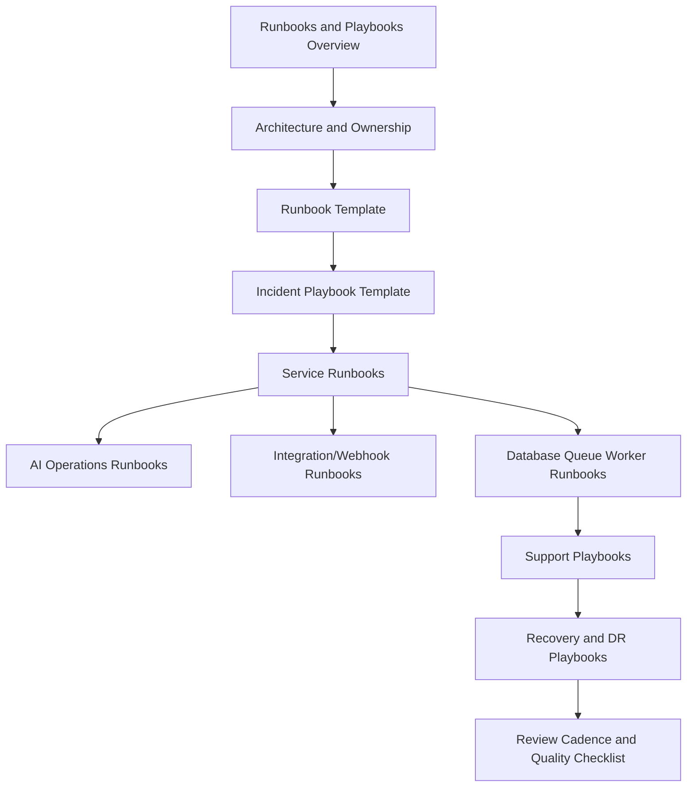

# PART-09 — Runbooks and Playbooks

> *"A good runbook turns panic into procedure."*

---

# Purpose

Part 09 defines CLARA's runbooks and playbooks model.

It covers:

- Runbooks and Playbooks overview.
- Runbook Architecture and Ownership.
- Runbook Template Standard.
- Incident Playbook Template Standard.
- Service Runbooks.
- AI Operations Runbooks.
- Integration and Webhook Runbooks.
- Database Queue and Worker Runbooks.
- Support Playbooks.
- Recovery and DR Playbooks.
- Runbook Review Cadence and Quality Checklist.

---

# Chapter Map

| Chapter | Title |
|---:|---|
| 97 | Runbooks and Playbooks Overview |
| 98 | Runbook Architecture and Ownership |
| 99 | Runbook Template Standard |
| 100 | Incident Playbook Template Standard |
| 101 | Service Runbooks |
| 102 | AI Operations Runbooks |
| 103 | Integration and Webhook Runbooks |
| 104 | Database Queue and Worker Runbooks |
| 105 | Support Playbooks |
| 106 | Recovery and DR Playbooks |
| 107 | Runbook Review Cadence and Quality Checklist |
| 108 | Part 09 Summary |

---

# Runbooks and Playbooks Map



---

# Runbook Non-Negotiables

CLARA runbooks and playbooks must enforce:

```text
clear owner
clear trigger
clear symptoms
linked dashboards/log queries
step-by-step diagnosis
safe mitigation steps
escalation path
customer/support notes where relevant
evidence to collect
rollback or disable path
security/privacy warnings
last reviewed date
review cadence
```

---

# Relationship to Previous Parts

Part 08 defines production support operations.

Part 09 defines repeatable procedures for operating, supporting, responding, and recovering production systems.

---

# Navigation

**Previous:** `../PART-08-Production-Support-Operations/96-Part-08-Summary.md`

**Next:** `97-Runbooks-and-Playbooks-Overview.md`
