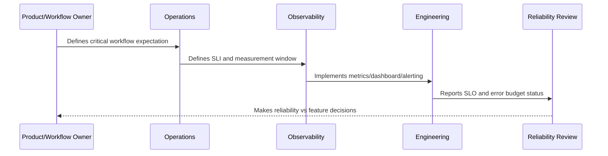

# SLOs SLIs and Error Budgets Overview

> *"Introduces CLARA's SLO, SLI, and error budget model for defining reliability expectations, measuring user-impacting service quality, and making production decisions."*

---

# Purpose

Introduces CLARA's SLO, SLI, and error budget model for defining reliability expectations, measuring user-impacting service quality, and making production decisions.

---

# Reliability Measurement Problem

Without explicit reliability objectives, teams argue from opinions instead of measured user impact.

---

# Reliability Decision

## Decision

CLARA should use SLOs, SLIs, and error budgets to connect reliability engineering with product expectations, alerting, release decisions, and customer trust.

## Status

Accepted.

---

# SLO Rule

Every production-critical CLARA workflow should be defined as:

```text
User Journey -> SLI -> SLO Target -> Measurement Window -> Error Budget -> Alerting Policy -> Review Cadence -> Owner
```

An SLO is not production-ready if the team cannot answer:

```text
what user outcome is measured
how success is calculated
what target is acceptable
who owns the objective
what happens when budget burns
what behavior changes when budget is depleted
how stakeholders see the status
```

---

# Recommended SLO Flow



---

# Production-Ready Checklist

- [ ] Critical user journey is identified.
- [ ] SLI is measurable.
- [ ] SLO target is defined.
- [ ] Measurement window is defined.
- [ ] Error budget is calculated.
- [ ] Owner is assigned.
- [ ] Alerting rule is defined.
- [ ] Dashboard/report exists.
- [ ] Error budget policy is defined.
- [ ] Review cadence is defined.

---

# Acceptance Criteria

- [ ] SLI represents user impact.
- [ ] SLO target is realistic.
- [ ] Measurement source is trustworthy.
- [ ] Alerting is actionable.
- [ ] Policy decision is clear.
- [ ] Reporting is useful to both engineers and stakeholders.
- [ ] AI coding assistants can follow this safely.

---

# Anti-patterns

Avoid:

- SLOs based only on server uptime.
- Too many SLOs for one service.
- SLOs nobody owns.
- SLOs that cannot be measured.
- SLO targets copied from large companies without context.
- Error budgets that do not influence release decisions.
- Alerting on raw errors but ignoring SLO burn.
- Using averages for latency-sensitive workflows.
- Hiding poor SLO performance from product/support.
- Treating AI quality/correctness as unmeasurable.

---

# Related Documents

- ../PART-09-Runbooks-and-Playbooks/README.md
- ../PART-05-Reliability-Engineering/README.md
- ../PART-04-Alerting-and-Incident-Operations/README.md
- ../PART-03-Logging-and-Metrics/README.md
- ../PART-06-Performance-and-Capacity/README.md

---

# Navigation

**Previous:** `../PART-09-Runbooks-and-Playbooks/108-Part-09-Summary.md`

**Next:** `110-SLO-Principles.md`

---

# SLO Vocabulary

```text
SLI = Service Level Indicator
A metric that represents service/user experience.

SLO = Service Level Objective
The target level expected for an SLI.

Error Budget
The allowed unreliability within a measurement window.
```

---

# CLARA SLO Scope

Initial SLO candidates:

```text
login availability
inbox load success
conversation open success
reply send success
ticket update success
AI draft generation success/latency
integration message ingestion success/delay
attachment upload/download success
export generation success/delay
```

---

# Core Question

```text
What level of reliability do users need for CLARA to remain trustworthy?
```
