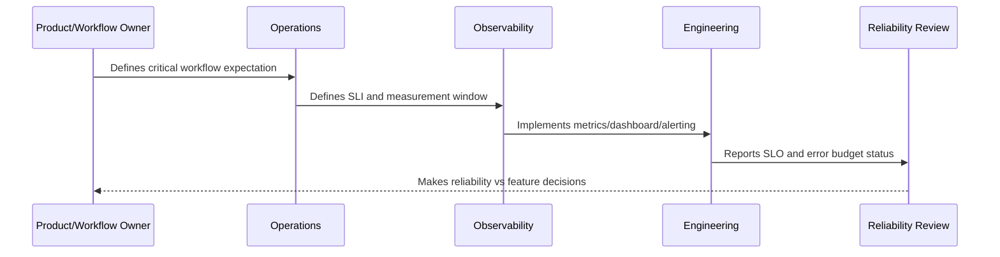

# SLI Selection Model

> *"Defines how CLARA selects service level indicators that accurately represent user experience and operational health."*

---

# Purpose

Defines how CLARA selects service level indicators that accurately represent user experience and operational health.

---

# Reliability Measurement Problem

Bad SLIs can make a system appear healthy while users experience failures.

---

# Reliability Decision

## Decision

CLARA should select SLIs based on critical user journeys, measurable outcomes, and signals responders can act on.

## Status

Accepted.

---

# SLO Rule

Every production-critical CLARA workflow should be defined as:

```text
User Journey -> SLI -> SLO Target -> Measurement Window -> Error Budget -> Alerting Policy -> Review Cadence -> Owner
```

An SLO is not production-ready if the team cannot answer:

```text
what user outcome is measured
how success is calculated
what target is acceptable
who owns the objective
what happens when budget burns
what behavior changes when budget is depleted
how stakeholders see the status
```

---

# Recommended SLO Flow



---

# Production-Ready Checklist

- [ ] Critical user journey is identified.
- [ ] SLI is measurable.
- [ ] SLO target is defined.
- [ ] Measurement window is defined.
- [ ] Error budget is calculated.
- [ ] Owner is assigned.
- [ ] Alerting rule is defined.
- [ ] Dashboard/report exists.
- [ ] Error budget policy is defined.
- [ ] Review cadence is defined.

---

# Acceptance Criteria

- [ ] SLI represents user impact.
- [ ] SLO target is realistic.
- [ ] Measurement source is trustworthy.
- [ ] Alerting is actionable.
- [ ] Policy decision is clear.
- [ ] Reporting is useful to both engineers and stakeholders.
- [ ] AI coding assistants can follow this safely.

---

# Anti-patterns

Avoid:

- SLOs based only on server uptime.
- Too many SLOs for one service.
- SLOs nobody owns.
- SLOs that cannot be measured.
- SLO targets copied from large companies without context.
- Error budgets that do not influence release decisions.
- Alerting on raw errors but ignoring SLO burn.
- Using averages for latency-sensitive workflows.
- Hiding poor SLO performance from product/support.
- Treating AI quality/correctness as unmeasurable.

---

# Related Documents

- ../PART-09-Runbooks-and-Playbooks/README.md
- ../PART-05-Reliability-Engineering/README.md
- ../PART-04-Alerting-and-Incident-Operations/README.md
- ../PART-03-Logging-and-Metrics/README.md
- ../PART-06-Performance-and-Capacity/README.md

---

# Navigation

**Previous:** `110-SLO-Principles.md`

**Next:** `112-Critical-Journey-SLOs.md`

---

# Good SLI Properties

A good SLI is:

```text
representative of user experience
measurable from reliable telemetry
low ambiguity
hard to game
actionable
owned
stable enough for trends
```

---

# SLI Types

Use:

```text
availability/success ratio
latency percentile
freshness/delay
correctness
durability/recovery
quality/acceptance where appropriate
```

---

# SLI Formula Examples

```text
reply_send_success_rate =
successful_reply_sends / total_reply_send_attempts

inbox_load_latency_p95 =
p95 duration of successful inbox loads

integration_ingestion_delay_p95 =
p95 time from webhook receipt to domain processing
```

---

# SLI Rule

Measure user-visible success where possible, not only internal component status.
