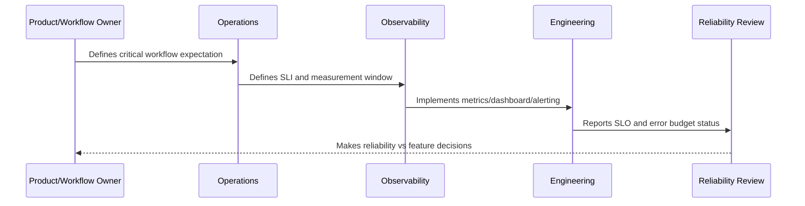

# Critical Journey SLOs

> *"Defines SLOs for CLARA's critical user journeys such as login, inbox, conversation open, reply send, ticket update, AI draft, integration ingestion, and export."*

---

# Purpose

Defines SLOs for CLARA's critical user journeys such as login, inbox, conversation open, reply send, ticket update, AI draft, integration ingestion, and export.

---

# Reliability Measurement Problem

Infrastructure availability is not enough if critical product workflows fail.

---

# Reliability Decision

## Decision

CLARA should prioritize SLOs around workflows that directly affect customer support operations and trust.

## Status

Accepted.

---

# SLO Rule

Every production-critical CLARA workflow should be defined as:

```text
User Journey -> SLI -> SLO Target -> Measurement Window -> Error Budget -> Alerting Policy -> Review Cadence -> Owner
```

An SLO is not production-ready if the team cannot answer:

```text
what user outcome is measured
how success is calculated
what target is acceptable
who owns the objective
what happens when budget burns
what behavior changes when budget is depleted
how stakeholders see the status
```

---

# Recommended SLO Flow



---

# Production-Ready Checklist

- [ ] Critical user journey is identified.
- [ ] SLI is measurable.
- [ ] SLO target is defined.
- [ ] Measurement window is defined.
- [ ] Error budget is calculated.
- [ ] Owner is assigned.
- [ ] Alerting rule is defined.
- [ ] Dashboard/report exists.
- [ ] Error budget policy is defined.
- [ ] Review cadence is defined.

---

# Acceptance Criteria

- [ ] SLI represents user impact.
- [ ] SLO target is realistic.
- [ ] Measurement source is trustworthy.
- [ ] Alerting is actionable.
- [ ] Policy decision is clear.
- [ ] Reporting is useful to both engineers and stakeholders.
- [ ] AI coding assistants can follow this safely.

---

# Anti-patterns

Avoid:

- SLOs based only on server uptime.
- Too many SLOs for one service.
- SLOs nobody owns.
- SLOs that cannot be measured.
- SLO targets copied from large companies without context.
- Error budgets that do not influence release decisions.
- Alerting on raw errors but ignoring SLO burn.
- Using averages for latency-sensitive workflows.
- Hiding poor SLO performance from product/support.
- Treating AI quality/correctness as unmeasurable.

---

# Related Documents

- ../PART-09-Runbooks-and-Playbooks/README.md
- ../PART-05-Reliability-Engineering/README.md
- ../PART-04-Alerting-and-Incident-Operations/README.md
- ../PART-03-Logging-and-Metrics/README.md
- ../PART-06-Performance-and-Capacity/README.md

---

# Navigation

**Previous:** `111-SLI-Selection-Model.md`

**Next:** `113-Availability-SLOs.md`

---

# Critical Journey SLO Candidates

| Journey | Example SLI | Initial Objective Type |
|---|---|---|
| Login | successful login/session creation rate | availability |
| Inbox Load | successful inbox load + p95 latency | availability + latency |
| Conversation Open | successful conversation read + p95 latency | availability + latency |
| Reply Send | successful reply send rate | availability/correctness |
| Ticket Update | successful ticket mutation rate | availability/correctness |
| AI Draft | generated draft success + p95 latency | availability/latency |
| Integration Ingestion | webhook processed successfully within target | availability/freshness |
| Export | export completed within target | availability/freshness |

---

# Journey SLO Template

```markdown
## Critical Journey SLO

Journey:
Owner:
User outcome:
SLI:
Target:
Window:
Error budget:
Dashboard:
Alert:
Policy:
Review cadence:
```

---

# Journey Rule

Start with the smallest set of SLOs that represents real customer trust.
