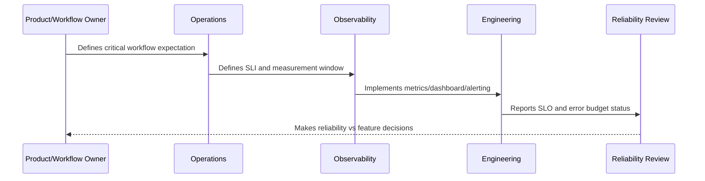

# Availability SLOs

> *"Defines availability SLOs for services, APIs, user journeys, AI features, integrations, queues, and dependencies."*

---

# Purpose

Defines availability SLOs for services, APIs, user journeys, AI features, integrations, queues, and dependencies.

---

# Reliability Measurement Problem

A service can be technically up while important actions are failing.

---

# Reliability Decision

## Decision

CLARA availability SLOs should measure successful user-visible operations, not only whether servers are running.

## Status

Accepted.

---

# SLO Rule

Every production-critical CLARA workflow should be defined as:

```text
User Journey -> SLI -> SLO Target -> Measurement Window -> Error Budget -> Alerting Policy -> Review Cadence -> Owner
```

An SLO is not production-ready if the team cannot answer:

```text
what user outcome is measured
how success is calculated
what target is acceptable
who owns the objective
what happens when budget burns
what behavior changes when budget is depleted
how stakeholders see the status
```

---

# Recommended SLO Flow



---

# Production-Ready Checklist

- [ ] Critical user journey is identified.
- [ ] SLI is measurable.
- [ ] SLO target is defined.
- [ ] Measurement window is defined.
- [ ] Error budget is calculated.
- [ ] Owner is assigned.
- [ ] Alerting rule is defined.
- [ ] Dashboard/report exists.
- [ ] Error budget policy is defined.
- [ ] Review cadence is defined.

---

# Acceptance Criteria

- [ ] SLI represents user impact.
- [ ] SLO target is realistic.
- [ ] Measurement source is trustworthy.
- [ ] Alerting is actionable.
- [ ] Policy decision is clear.
- [ ] Reporting is useful to both engineers and stakeholders.
- [ ] AI coding assistants can follow this safely.

---

# Anti-patterns

Avoid:

- SLOs based only on server uptime.
- Too many SLOs for one service.
- SLOs nobody owns.
- SLOs that cannot be measured.
- SLO targets copied from large companies without context.
- Error budgets that do not influence release decisions.
- Alerting on raw errors but ignoring SLO burn.
- Using averages for latency-sensitive workflows.
- Hiding poor SLO performance from product/support.
- Treating AI quality/correctness as unmeasurable.

---

# Related Documents

- ../PART-09-Runbooks-and-Playbooks/README.md
- ../PART-05-Reliability-Engineering/README.md
- ../PART-04-Alerting-and-Incident-Operations/README.md
- ../PART-03-Logging-and-Metrics/README.md
- ../PART-06-Performance-and-Capacity/README.md

---

# Navigation

**Previous:** `112-Critical-Journey-SLOs.md`

**Next:** `114-Latency-SLOs.md`

---

# Availability SLO Patterns

Use availability SLOs for:

```text
API requests
critical user workflow success
queue processing success
AI Gateway request success
integration event processing success
export completion success
file upload/download success
```

---

# Availability Formula

```text
availability = good_events / valid_events
```

Good events should represent successful user-visible outcome.

Valid events should exclude clearly invalid user input where appropriate.

---

# Availability Warning

Do not make availability look better by excluding real system failures from the denominator.
