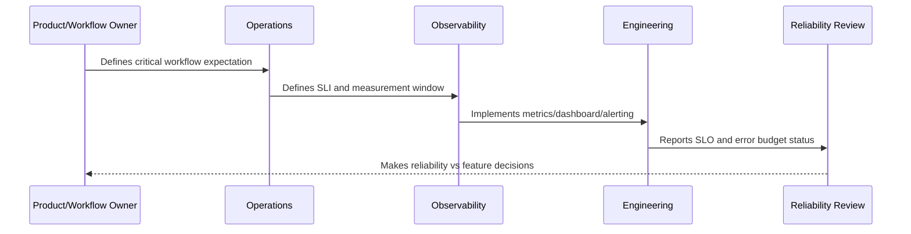

# Latency SLOs

> *"Defines latency SLOs for APIs, frontend workflows, database-backed operations, queues, AI generation, integrations, exports, and attachments."*

---

# Purpose

Defines latency SLOs for APIs, frontend workflows, database-backed operations, queues, AI generation, integrations, exports, and attachments.

---

# Reliability Measurement Problem

Slow systems can be perceived as broken and can cascade into reliability incidents.

---

# Reliability Decision

## Decision

CLARA latency SLOs should protect user experience and operational throughput using realistic percentile-based objectives.

## Status

Accepted.

---

# SLO Rule

Every production-critical CLARA workflow should be defined as:

```text
User Journey -> SLI -> SLO Target -> Measurement Window -> Error Budget -> Alerting Policy -> Review Cadence -> Owner
```

An SLO is not production-ready if the team cannot answer:

```text
what user outcome is measured
how success is calculated
what target is acceptable
who owns the objective
what happens when budget burns
what behavior changes when budget is depleted
how stakeholders see the status
```

---

# Recommended SLO Flow



---

# Production-Ready Checklist

- [ ] Critical user journey is identified.
- [ ] SLI is measurable.
- [ ] SLO target is defined.
- [ ] Measurement window is defined.
- [ ] Error budget is calculated.
- [ ] Owner is assigned.
- [ ] Alerting rule is defined.
- [ ] Dashboard/report exists.
- [ ] Error budget policy is defined.
- [ ] Review cadence is defined.

---

# Acceptance Criteria

- [ ] SLI represents user impact.
- [ ] SLO target is realistic.
- [ ] Measurement source is trustworthy.
- [ ] Alerting is actionable.
- [ ] Policy decision is clear.
- [ ] Reporting is useful to both engineers and stakeholders.
- [ ] AI coding assistants can follow this safely.

---

# Anti-patterns

Avoid:

- SLOs based only on server uptime.
- Too many SLOs for one service.
- SLOs nobody owns.
- SLOs that cannot be measured.
- SLO targets copied from large companies without context.
- Error budgets that do not influence release decisions.
- Alerting on raw errors but ignoring SLO burn.
- Using averages for latency-sensitive workflows.
- Hiding poor SLO performance from product/support.
- Treating AI quality/correctness as unmeasurable.

---

# Related Documents

- ../PART-09-Runbooks-and-Playbooks/README.md
- ../PART-05-Reliability-Engineering/README.md
- ../PART-04-Alerting-and-Incident-Operations/README.md
- ../PART-03-Logging-and-Metrics/README.md
- ../PART-06-Performance-and-Capacity/README.md

---

# Navigation

**Previous:** `113-Availability-SLOs.md`

**Next:** `115-Quality-and-Correctness-SLOs.md`

---

# Latency SLO Patterns

Use latency SLOs for:

```text
inbox load
conversation open
reply send acknowledgement
ticket update
knowledge search
AI draft generation
integration processing delay
export completion
attachment upload/download
```

---

# Latency Guidance

Prefer percentiles:

```text
p50 = typical experience
p95 = most users
p99 = worst-tail experience
```

Avoid averages for user-facing latency.

---

# Latency Rule

Latency SLOs should define whether timeout, fallback, or degraded response counts as success or failure.
