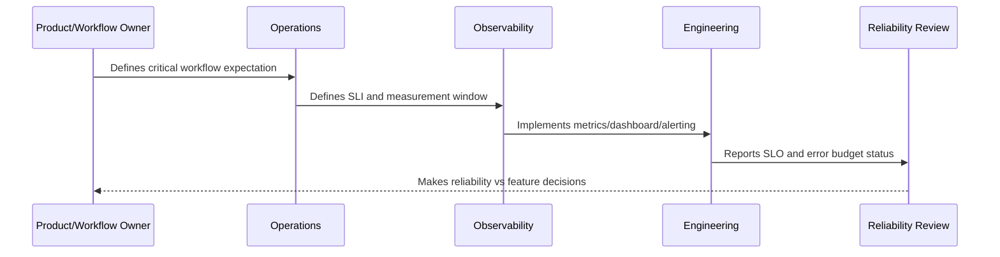

# Quality and Correctness SLOs

> *"Defines SLOs for correctness-sensitive workflows including duplicate prevention, idempotency, AI review quality, integration processing correctness, and data consistency."*

---

# Purpose

Defines SLOs for correctness-sensitive workflows including duplicate prevention, idempotency, AI review quality, integration processing correctness, and data consistency.

---

# Reliability Measurement Problem

A fast and available system is still unreliable if it produces duplicate, wrong, unsafe, or inconsistent results.

---

# Reliability Decision

## Decision

CLARA should measure reliability not only as uptime, but also as correctness of outcomes.

## Status

Accepted.

---

# SLO Rule

Every production-critical CLARA workflow should be defined as:

```text
User Journey -> SLI -> SLO Target -> Measurement Window -> Error Budget -> Alerting Policy -> Review Cadence -> Owner
```

An SLO is not production-ready if the team cannot answer:

```text
what user outcome is measured
how success is calculated
what target is acceptable
who owns the objective
what happens when budget burns
what behavior changes when budget is depleted
how stakeholders see the status
```

---

# Recommended SLO Flow



---

# Production-Ready Checklist

- [ ] Critical user journey is identified.
- [ ] SLI is measurable.
- [ ] SLO target is defined.
- [ ] Measurement window is defined.
- [ ] Error budget is calculated.
- [ ] Owner is assigned.
- [ ] Alerting rule is defined.
- [ ] Dashboard/report exists.
- [ ] Error budget policy is defined.
- [ ] Review cadence is defined.

---

# Acceptance Criteria

- [ ] SLI represents user impact.
- [ ] SLO target is realistic.
- [ ] Measurement source is trustworthy.
- [ ] Alerting is actionable.
- [ ] Policy decision is clear.
- [ ] Reporting is useful to both engineers and stakeholders.
- [ ] AI coding assistants can follow this safely.

---

# Anti-patterns

Avoid:

- SLOs based only on server uptime.
- Too many SLOs for one service.
- SLOs nobody owns.
- SLOs that cannot be measured.
- SLO targets copied from large companies without context.
- Error budgets that do not influence release decisions.
- Alerting on raw errors but ignoring SLO burn.
- Using averages for latency-sensitive workflows.
- Hiding poor SLO performance from product/support.
- Treating AI quality/correctness as unmeasurable.

---

# Related Documents

- ../PART-09-Runbooks-and-Playbooks/README.md
- ../PART-05-Reliability-Engineering/README.md
- ../PART-04-Alerting-and-Incident-Operations/README.md
- ../PART-03-Logging-and-Metrics/README.md
- ../PART-06-Performance-and-Capacity/README.md

---

# Navigation

**Previous:** `114-Latency-SLOs.md`

**Next:** `116-Error-Budget-Model.md`

---

# Correctness SLO Candidates

Track correctness for:

```text
duplicate reply prevention
duplicate ticket creation prevention
webhook idempotency
integration event final state correctness
AI human review acceptance/edit/reject rate
authorization denied correctness
data export completeness
file metadata consistency
```

---

# Correctness Examples

```text
duplicate_outbound_message_rate
webhook_duplicate_side_effect_rate
ticket_update_conflict_rate
ai_output_rejection_rate
export_validation_failure_rate
```

---

# Correctness Rule

Reliability should include “did the right thing happen?” not only “did something happen?”
