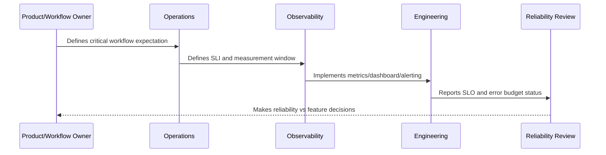

# Error Budget Model

> *"Defines how CLARA calculates, tracks, burns, and interprets error budgets across services and critical workflows."*

---

# Purpose

Defines how CLARA calculates, tracks, burns, and interprets error budgets across services and critical workflows.

---

# Reliability Measurement Problem

Without an error budget, teams lack a practical way to decide when reliability work should slow feature delivery.

---

# Reliability Decision

## Decision

CLARA error budgets should create a shared language for balancing feature velocity and reliability work.

## Status

Accepted.

---

# SLO Rule

Every production-critical CLARA workflow should be defined as:

```text
User Journey -> SLI -> SLO Target -> Measurement Window -> Error Budget -> Alerting Policy -> Review Cadence -> Owner
```

An SLO is not production-ready if the team cannot answer:

```text
what user outcome is measured
how success is calculated
what target is acceptable
who owns the objective
what happens when budget burns
what behavior changes when budget is depleted
how stakeholders see the status
```

---

# Recommended SLO Flow



---

# Production-Ready Checklist

- [ ] Critical user journey is identified.
- [ ] SLI is measurable.
- [ ] SLO target is defined.
- [ ] Measurement window is defined.
- [ ] Error budget is calculated.
- [ ] Owner is assigned.
- [ ] Alerting rule is defined.
- [ ] Dashboard/report exists.
- [ ] Error budget policy is defined.
- [ ] Review cadence is defined.

---

# Acceptance Criteria

- [ ] SLI represents user impact.
- [ ] SLO target is realistic.
- [ ] Measurement source is trustworthy.
- [ ] Alerting is actionable.
- [ ] Policy decision is clear.
- [ ] Reporting is useful to both engineers and stakeholders.
- [ ] AI coding assistants can follow this safely.

---

# Anti-patterns

Avoid:

- SLOs based only on server uptime.
- Too many SLOs for one service.
- SLOs nobody owns.
- SLOs that cannot be measured.
- SLO targets copied from large companies without context.
- Error budgets that do not influence release decisions.
- Alerting on raw errors but ignoring SLO burn.
- Using averages for latency-sensitive workflows.
- Hiding poor SLO performance from product/support.
- Treating AI quality/correctness as unmeasurable.

---

# Related Documents

- ../PART-09-Runbooks-and-Playbooks/README.md
- ../PART-05-Reliability-Engineering/README.md
- ../PART-04-Alerting-and-Incident-Operations/README.md
- ../PART-03-Logging-and-Metrics/README.md
- ../PART-06-Performance-and-Capacity/README.md

---

# Navigation

**Previous:** `115-Quality-and-Correctness-SLOs.md`

**Next:** `117-Alerting-from-SLOs.md`

---

# Error Budget Concept

If an SLO target is 99.5% over a period, the error budget is 0.5% of valid events in that period.

```text
error_budget = 1 - SLO_target
```

Example:

```text
10,000 valid reply send attempts
SLO target: 99.5%
Allowed failed attempts: 50
```

---

# Budget Burn

Track:

```text
budget remaining
burn rate
forecast depletion
top contributors
incident linkage
release correlation
```

---

# Error Budget Rule

Error budget should help decide when to prioritize reliability work over feature velocity.
