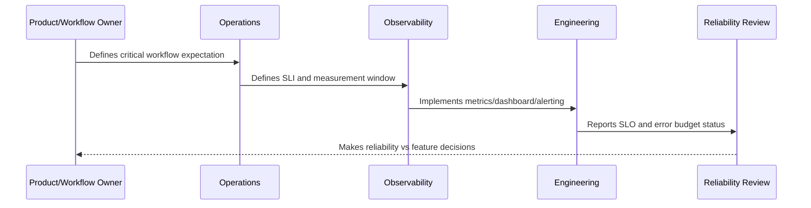

# Alerting from SLOs

> *"Defines how CLARA uses SLO burn rates, symptoms, windows, and user impact to create better alerts."*

---

# Purpose

Defines how CLARA uses SLO burn rates, symptoms, windows, and user impact to create better alerts.

---

# Reliability Measurement Problem

Alerting on every technical anomaly creates noise, while alerting too late allows user impact to grow.

---

# Reliability Decision

## Decision

CLARA should alert on meaningful SLO burn and customer-impacting symptoms rather than every low-level technical fluctuation.

## Status

Accepted.

---

# SLO Rule

Every production-critical CLARA workflow should be defined as:

```text
User Journey -> SLI -> SLO Target -> Measurement Window -> Error Budget -> Alerting Policy -> Review Cadence -> Owner
```

An SLO is not production-ready if the team cannot answer:

```text
what user outcome is measured
how success is calculated
what target is acceptable
who owns the objective
what happens when budget burns
what behavior changes when budget is depleted
how stakeholders see the status
```

---

# Recommended SLO Flow



---

# Production-Ready Checklist

- [ ] Critical user journey is identified.
- [ ] SLI is measurable.
- [ ] SLO target is defined.
- [ ] Measurement window is defined.
- [ ] Error budget is calculated.
- [ ] Owner is assigned.
- [ ] Alerting rule is defined.
- [ ] Dashboard/report exists.
- [ ] Error budget policy is defined.
- [ ] Review cadence is defined.

---

# Acceptance Criteria

- [ ] SLI represents user impact.
- [ ] SLO target is realistic.
- [ ] Measurement source is trustworthy.
- [ ] Alerting is actionable.
- [ ] Policy decision is clear.
- [ ] Reporting is useful to both engineers and stakeholders.
- [ ] AI coding assistants can follow this safely.

---

# Anti-patterns

Avoid:

- SLOs based only on server uptime.
- Too many SLOs for one service.
- SLOs nobody owns.
- SLOs that cannot be measured.
- SLO targets copied from large companies without context.
- Error budgets that do not influence release decisions.
- Alerting on raw errors but ignoring SLO burn.
- Using averages for latency-sensitive workflows.
- Hiding poor SLO performance from product/support.
- Treating AI quality/correctness as unmeasurable.

---

# Related Documents

- ../PART-09-Runbooks-and-Playbooks/README.md
- ../PART-05-Reliability-Engineering/README.md
- ../PART-04-Alerting-and-Incident-Operations/README.md
- ../PART-03-Logging-and-Metrics/README.md
- ../PART-06-Performance-and-Capacity/README.md

---

# Navigation

**Previous:** `116-Error-Budget-Model.md`

**Next:** `118-Error-Budget-Policy.md`

---

# SLO Alerting Types

Use:

```text
fast burn alert
slow burn alert
budget exhaustion warning
SLO violation report
customer-impact symptom alert
```

---

# Alerting Principles

SLO alerts should be:

```text
symptom-based
owned
actionable
runbook-linked
low-noise
customer-impact aware
```

---

# Example Alert Policy

```markdown
## Alert: Reply Send SLO Fast Burn

Trigger:
Reply send error budget burning too fast over short window.

Owner:
Messaging/Conversation Service Owner.

Action:
Check reply send dashboard, provider status, queue backlog, recent deploys.

Runbook:
reply-sending-runbook.md
```

---

# Alert Rule

SLO alerting should page when action is needed, not when a dashboard could simply be reviewed later.
