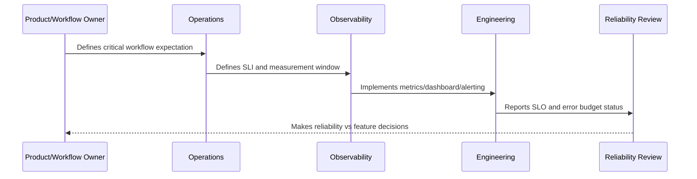

# Error Budget Policy

> *"Defines policy decisions when error budgets are healthy, burning fast, depleted, or repeatedly violated."*

---

# Purpose

Defines policy decisions when error budgets are healthy, burning fast, depleted, or repeatedly violated.

---

# Reliability Measurement Problem

SLOs are weak if breaching them does not change team behavior.

---

# Reliability Decision

## Decision

CLARA should use error budget status to influence release decisions, reliability prioritization, incident follow-up, and leadership reporting.

## Status

Accepted.

---

# SLO Rule

Every production-critical CLARA workflow should be defined as:

```text
User Journey -> SLI -> SLO Target -> Measurement Window -> Error Budget -> Alerting Policy -> Review Cadence -> Owner
```

An SLO is not production-ready if the team cannot answer:

```text
what user outcome is measured
how success is calculated
what target is acceptable
who owns the objective
what happens when budget burns
what behavior changes when budget is depleted
how stakeholders see the status
```

---

# Recommended SLO Flow



---

# Production-Ready Checklist

- [ ] Critical user journey is identified.
- [ ] SLI is measurable.
- [ ] SLO target is defined.
- [ ] Measurement window is defined.
- [ ] Error budget is calculated.
- [ ] Owner is assigned.
- [ ] Alerting rule is defined.
- [ ] Dashboard/report exists.
- [ ] Error budget policy is defined.
- [ ] Review cadence is defined.

---

# Acceptance Criteria

- [ ] SLI represents user impact.
- [ ] SLO target is realistic.
- [ ] Measurement source is trustworthy.
- [ ] Alerting is actionable.
- [ ] Policy decision is clear.
- [ ] Reporting is useful to both engineers and stakeholders.
- [ ] AI coding assistants can follow this safely.

---

# Anti-patterns

Avoid:

- SLOs based only on server uptime.
- Too many SLOs for one service.
- SLOs nobody owns.
- SLOs that cannot be measured.
- SLO targets copied from large companies without context.
- Error budgets that do not influence release decisions.
- Alerting on raw errors but ignoring SLO burn.
- Using averages for latency-sensitive workflows.
- Hiding poor SLO performance from product/support.
- Treating AI quality/correctness as unmeasurable.

---

# Related Documents

- ../PART-09-Runbooks-and-Playbooks/README.md
- ../PART-05-Reliability-Engineering/README.md
- ../PART-04-Alerting-and-Incident-Operations/README.md
- ../PART-03-Logging-and-Metrics/README.md
- ../PART-06-Performance-and-Capacity/README.md

---

# Navigation

**Previous:** `117-Alerting-from-SLOs.md`

**Next:** `119-SLO-Reporting-and-Review-Cadence.md`

---

# Error Budget States

| State | Meaning | Expected Behavior |
|---|---|---|
| Healthy | Budget mostly available | normal delivery |
| Watch | Burn increasing | investigate trend |
| At Risk | budget likely to deplete | prioritize reliability work |
| Depleted | SLO violated or near violation | restrict risky releases |
| Repeated Violation | systemic issue | reliability roadmap required |

---

# Policy Actions

When budget is depleted:

```text
pause risky releases
prioritize bug/reliability work
review recent changes
update runbooks/alerts
perform incident or reliability review
communicate status to stakeholders
```

---

# Policy Rule

Error budget policy should be agreed before the budget is depleted.
