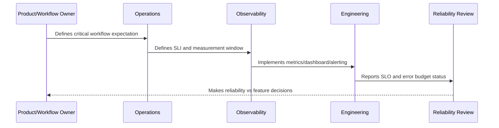

# SLO Reporting and Review Cadence

> *"Defines reporting, dashboards, review rhythm, ownership, evidence, and reliability review practices for SLOs and error budgets."*

---

# Purpose

Defines reporting, dashboards, review rhythm, ownership, evidence, and reliability review practices for SLOs and error budgets.

---

# Reliability Measurement Problem

Reliability reports are not useful if they are too technical for stakeholders or too vague for engineers.

---

# Reliability Decision

## Decision

CLARA SLO reporting should make reliability visible to engineering, product, support, operations, and leadership.

## Status

Accepted.

---

# SLO Rule

Every production-critical CLARA workflow should be defined as:

```text
User Journey -> SLI -> SLO Target -> Measurement Window -> Error Budget -> Alerting Policy -> Review Cadence -> Owner
```

An SLO is not production-ready if the team cannot answer:

```text
what user outcome is measured
how success is calculated
what target is acceptable
who owns the objective
what happens when budget burns
what behavior changes when budget is depleted
how stakeholders see the status
```

---

# Recommended SLO Flow



---

# Production-Ready Checklist

- [ ] Critical user journey is identified.
- [ ] SLI is measurable.
- [ ] SLO target is defined.
- [ ] Measurement window is defined.
- [ ] Error budget is calculated.
- [ ] Owner is assigned.
- [ ] Alerting rule is defined.
- [ ] Dashboard/report exists.
- [ ] Error budget policy is defined.
- [ ] Review cadence is defined.

---

# Acceptance Criteria

- [ ] SLI represents user impact.
- [ ] SLO target is realistic.
- [ ] Measurement source is trustworthy.
- [ ] Alerting is actionable.
- [ ] Policy decision is clear.
- [ ] Reporting is useful to both engineers and stakeholders.
- [ ] AI coding assistants can follow this safely.

---

# Anti-patterns

Avoid:

- SLOs based only on server uptime.
- Too many SLOs for one service.
- SLOs nobody owns.
- SLOs that cannot be measured.
- SLO targets copied from large companies without context.
- Error budgets that do not influence release decisions.
- Alerting on raw errors but ignoring SLO burn.
- Using averages for latency-sensitive workflows.
- Hiding poor SLO performance from product/support.
- Treating AI quality/correctness as unmeasurable.

---

# Related Documents

- ../PART-09-Runbooks-and-Playbooks/README.md
- ../PART-05-Reliability-Engineering/README.md
- ../PART-04-Alerting-and-Incident-Operations/README.md
- ../PART-03-Logging-and-Metrics/README.md
- ../PART-06-Performance-and-Capacity/README.md

---

# Navigation

**Previous:** `118-Error-Budget-Policy.md`

**Next:** `120-Part-10-Summary.md`

---

# SLO Reporting

Reports should show:

```text
SLO name
owner
target
current performance
error budget remaining
burn rate
incidents linked
top failure causes
release correlation
customer impact summary
next actions
```

---

# Review Cadence

Recommended:

```text
weekly for active SLO risk
monthly reliability review
quarterly SLO target review
after significant incidents
before major enterprise/customer readiness review
```

---

# Stakeholder Views

Create views for:

```text
engineering detail
product/customer impact
support readiness
leadership summary
operations action list
```

---

# Reporting Rule

SLO reports should be understandable by non-engineering stakeholders while still useful for engineering action.
