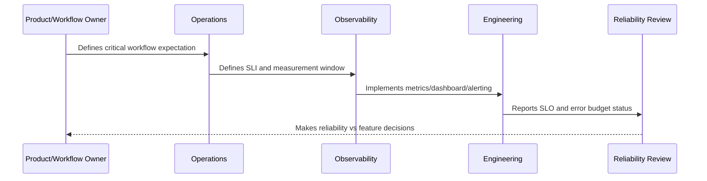

# Part 10 Summary

> *"Summarizes SLOs, SLIs, and Error Budgets and prepares for Book VII Part 11."*

---

# Purpose

Summarizes SLOs, SLIs, and Error Budgets and prepares for Book VII Part 11.

---

# Reliability Measurement Problem

Operational security comes next because production reliability and security operations must work together.

---

# Reliability Decision

## Decision

CLARA should proceed to Operational Security after defining SLO principles, SLI selection, critical journey SLOs, availability, latency, correctness, error budgets, SLO alerting, policy, and reporting.

## Status

Accepted.

---

# SLO Rule

Every production-critical CLARA workflow should be defined as:

```text
User Journey -> SLI -> SLO Target -> Measurement Window -> Error Budget -> Alerting Policy -> Review Cadence -> Owner
```

An SLO is not production-ready if the team cannot answer:

```text
what user outcome is measured
how success is calculated
what target is acceptable
who owns the objective
what happens when budget burns
what behavior changes when budget is depleted
how stakeholders see the status
```

---

# Recommended SLO Flow



---

# Production-Ready Checklist

- [ ] Critical user journey is identified.
- [ ] SLI is measurable.
- [ ] SLO target is defined.
- [ ] Measurement window is defined.
- [ ] Error budget is calculated.
- [ ] Owner is assigned.
- [ ] Alerting rule is defined.
- [ ] Dashboard/report exists.
- [ ] Error budget policy is defined.
- [ ] Review cadence is defined.

---

# Acceptance Criteria

- [ ] SLI represents user impact.
- [ ] SLO target is realistic.
- [ ] Measurement source is trustworthy.
- [ ] Alerting is actionable.
- [ ] Policy decision is clear.
- [ ] Reporting is useful to both engineers and stakeholders.
- [ ] AI coding assistants can follow this safely.

---

# Anti-patterns

Avoid:

- SLOs based only on server uptime.
- Too many SLOs for one service.
- SLOs nobody owns.
- SLOs that cannot be measured.
- SLO targets copied from large companies without context.
- Error budgets that do not influence release decisions.
- Alerting on raw errors but ignoring SLO burn.
- Using averages for latency-sensitive workflows.
- Hiding poor SLO performance from product/support.
- Treating AI quality/correctness as unmeasurable.

---

# Related Documents

- ../PART-09-Runbooks-and-Playbooks/README.md
- ../PART-05-Reliability-Engineering/README.md
- ../PART-04-Alerting-and-Incident-Operations/README.md
- ../PART-03-Logging-and-Metrics/README.md
- ../PART-06-Performance-and-Capacity/README.md

---

# Navigation

**Previous:** `119-SLO-Reporting-and-Review-Cadence.md`

**Next:** `../PART-11-Operational-Security/README.md`

---

# Part 10 Completion

Part 10 establishes:

- SLOs, SLIs, and error budgets overview.
- SLO principles.
- SLI selection model.
- Critical journey SLOs.
- Availability SLOs.
- Latency SLOs.
- Quality and correctness SLOs.
- Error budget model.
- Alerting from SLOs.
- Error budget policy.
- SLO reporting and review cadence.

---

# Ready for Part 11

The next part should be:

```text
BOOK VII — PART 11: Operational Security
```

It should define:

- Operational security principles.
- Production access controls.
- Secrets and credential operations.
- Secure deployment operations.
- Runtime hardening.
- Security monitoring.
- Vulnerability operations.
- Incident-security coordination.
- Operational audit evidence.
- Security operations review cadence.
