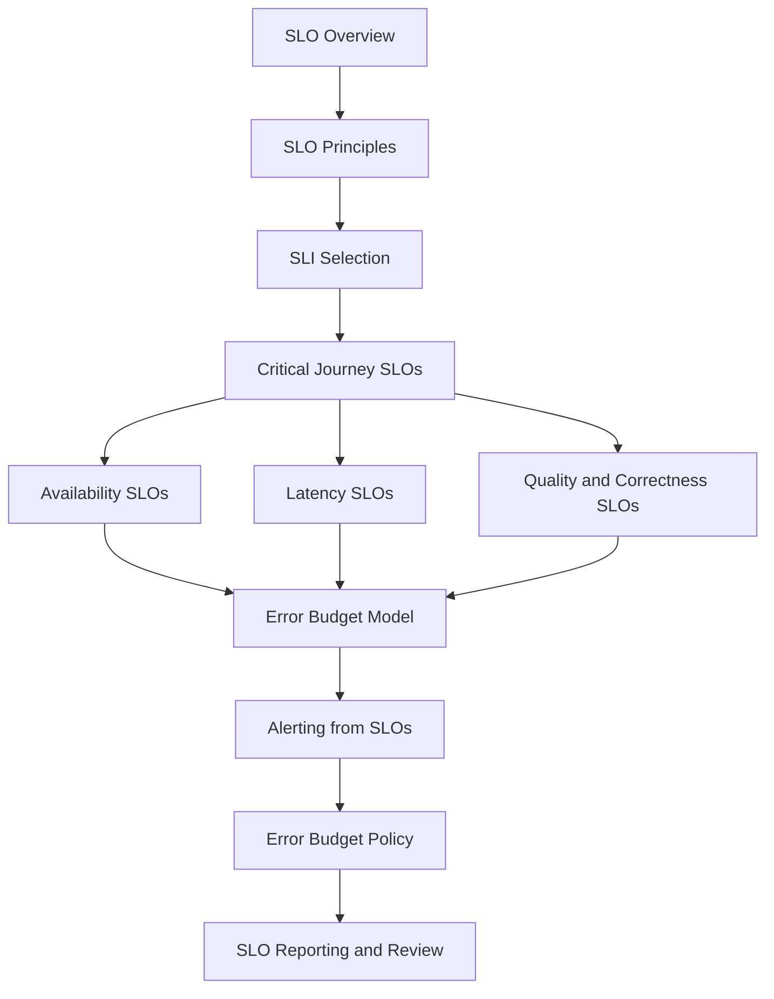

# PART-10 — SLOs, SLIs, and Error Budgets

> *"Reliability becomes manageable when user expectations become measurable."*

---

# Purpose

Part 10 defines CLARA's SLO, SLI, and error budget model.

It covers:

- SLOs, SLIs, and Error Budgets overview.
- SLO Principles.
- SLI Selection Model.
- Critical Journey SLOs.
- Availability SLOs.
- Latency SLOs.
- Quality and Correctness SLOs.
- Error Budget Model.
- Alerting from SLOs.
- Error Budget Policy.
- SLO Reporting and Review Cadence.

---

# Chapter Map

| Chapter | Title |
|---:|---|
| 109 | SLOs SLIs and Error Budgets Overview |
| 110 | SLO Principles |
| 111 | SLI Selection Model |
| 112 | Critical Journey SLOs |
| 113 | Availability SLOs |
| 114 | Latency SLOs |
| 115 | Quality and Correctness SLOs |
| 116 | Error Budget Model |
| 117 | Alerting from SLOs |
| 118 | Error Budget Policy |
| 119 | SLO Reporting and Review Cadence |
| 120 | Part 10 Summary |

---

# SLO/SPI/Error Budget Map



---

# SLO Non-Negotiables

CLARA SLOs must enforce:

```text
critical user journey focus
clear SLI definitions
measurable reliability targets
explicit measurement window
service/workflow ownership
availability and latency objectives
correctness where user harm is possible
error budget calculation
SLO-based alerting
release/risk policy based on error budget
review cadence
stakeholder-friendly reporting
```

---

# Relationship to Previous Parts

Part 09 defines runbooks and playbooks.

Part 10 defines reliability targets and decision rules that guide when runbooks, alerts, and reliability work should activate.

---

# Navigation

**Previous:** `../PART-09-Runbooks-and-Playbooks/108-Part-09-Summary.md`

**Next:** `109-SLOs-SLIs-and-Error-Budgets-Overview.md`
