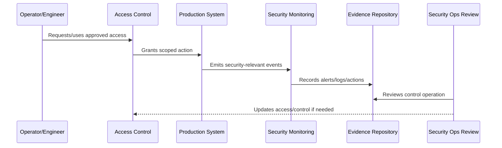

# Operational Security Overview

> *"Introduces CLARA's operational security model for protecting production access, secrets, deployments, runtime systems, monitoring, vulnerabilities, incidents, and operational evidence."*

---

# Purpose

Introduces CLARA's operational security model for protecting production access, secrets, deployments, runtime systems, monitoring, vulnerabilities, incidents, and operational evidence.

---

# Security Operations Problem

A secure application can still be compromised through weak production operations.

---

# Security Operations Decision

## Decision

CLARA should treat operational security as a production discipline that protects how systems are accessed, deployed, monitored, patched, and recovered.

## Status

Accepted.

---

# Operational Security Rule

Every production security-sensitive operation must be governed as:

```text
Action -> Owner -> Authorization -> Execution -> Audit Evidence -> Monitoring -> Review -> Improvement
```

A production operation is not secure if the team cannot answer:

```text
who is allowed to do it
why access is needed
what approval is required
how action is logged
how misuse is detected
how rollback/containment works
how evidence is retained
how access is reviewed
```

---

# Recommended Security Operations Flow



---

# Production-Ready Checklist

- [ ] Owner is assigned.
- [ ] Required access is defined.
- [ ] Least privilege is applied.
- [ ] Approval path is defined for privileged actions.
- [ ] Audit evidence is captured.
- [ ] Monitoring/detection exists where relevant.
- [ ] Secrets are protected.
- [ ] Runtime configuration is secure.
- [ ] Incident containment path exists.
- [ ] Review cadence is defined.

---

# Acceptance Criteria

- [ ] Security-sensitive operation is clear.
- [ ] Access and approval are clear.
- [ ] Audit evidence is clear.
- [ ] Monitoring and detection expectations are clear.
- [ ] Incident coordination is clear.
- [ ] Review cadence is clear.
- [ ] AI coding assistants can follow this safely.

---

# Anti-patterns

Avoid:

- Shared production accounts.
- Permanent broad admin access.
- Hard-coded secrets.
- Secrets in logs, tickets, docs, or screenshots.
- Deployment from untrusted machines.
- Production debug mode enabled.
- Unreviewed pipeline changes.
- Security alerts with no owner.
- Vulnerability tickets with no due date.
- Destroying evidence during incident response.

---

# Related Documents

- ../PART-10-SLOs-SLIs-and-Error-Budgets/README.md
- ../PART-04-Alerting-and-Incident-Operations/README.md
- ../PART-07-Backup-Restore-and-Disaster-Recovery/README.md
- ../../BOOK-06-Security-Governance-and-Compliance/PART-02-Security-Policies-and-Standards/README.md
- ../../BOOK-06-Security-Governance-and-Compliance/PART-03-Identity-and-Access-Governance/README.md
- ../../BOOK-06-Security-Governance-and-Compliance/PART-08-Incident-Response-and-Business-Continuity-Governance/README.md

---

# Navigation

**Previous:** `../PART-10-SLOs-SLIs-and-Error-Budgets/120-Part-10-Summary.md`

**Next:** `122-Operational-Security-Principles.md`

---

# Operational Security Scope

CLARA operational security covers:

```text
production access
privileged actions
service accounts
CI/CD access
secrets and credentials
deployment pipeline
runtime configuration
network exposure
security monitoring
vulnerability remediation
incident containment
operational audit evidence
```

---

# Core Questions

```text
Who can access production?
How are changes deployed?
Where do secrets live?
What detects suspicious behavior?
How are vulnerabilities fixed?
How do we contain compromise?
What evidence proves controls work?
```
