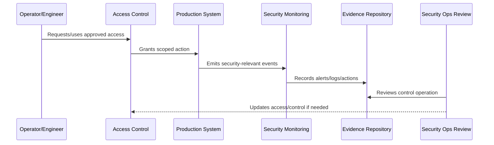

# Production Access Controls

> *"Defines production access control requirements for engineers, operators, support, service accounts, CI/CD, emergency access, and privileged actions."*

---

# Purpose

Defines production access control requirements for engineers, operators, support, service accounts, CI/CD, emergency access, and privileged actions.

---

# Security Operations Problem

Production access is one of the highest-risk operational surfaces.

---

# Security Operations Decision

## Decision

CLARA production access should be least-privilege, role-based, time-bound where possible, auditable, and reviewed on cadence.

## Status

Accepted.

---

# Operational Security Rule

Every production security-sensitive operation must be governed as:

```text
Action -> Owner -> Authorization -> Execution -> Audit Evidence -> Monitoring -> Review -> Improvement
```

A production operation is not secure if the team cannot answer:

```text
who is allowed to do it
why access is needed
what approval is required
how action is logged
how misuse is detected
how rollback/containment works
how evidence is retained
how access is reviewed
```

---

# Recommended Security Operations Flow



---

# Production-Ready Checklist

- [ ] Owner is assigned.
- [ ] Required access is defined.
- [ ] Least privilege is applied.
- [ ] Approval path is defined for privileged actions.
- [ ] Audit evidence is captured.
- [ ] Monitoring/detection exists where relevant.
- [ ] Secrets are protected.
- [ ] Runtime configuration is secure.
- [ ] Incident containment path exists.
- [ ] Review cadence is defined.

---

# Acceptance Criteria

- [ ] Security-sensitive operation is clear.
- [ ] Access and approval are clear.
- [ ] Audit evidence is clear.
- [ ] Monitoring and detection expectations are clear.
- [ ] Incident coordination is clear.
- [ ] Review cadence is clear.
- [ ] AI coding assistants can follow this safely.

---

# Anti-patterns

Avoid:

- Shared production accounts.
- Permanent broad admin access.
- Hard-coded secrets.
- Secrets in logs, tickets, docs, or screenshots.
- Deployment from untrusted machines.
- Production debug mode enabled.
- Unreviewed pipeline changes.
- Security alerts with no owner.
- Vulnerability tickets with no due date.
- Destroying evidence during incident response.

---

# Related Documents

- ../PART-10-SLOs-SLIs-and-Error-Budgets/README.md
- ../PART-04-Alerting-and-Incident-Operations/README.md
- ../PART-07-Backup-Restore-and-Disaster-Recovery/README.md
- ../../BOOK-06-Security-Governance-and-Compliance/PART-02-Security-Policies-and-Standards/README.md
- ../../BOOK-06-Security-Governance-and-Compliance/PART-03-Identity-and-Access-Governance/README.md
- ../../BOOK-06-Security-Governance-and-Compliance/PART-08-Incident-Response-and-Business-Continuity-Governance/README.md

---

# Navigation

**Previous:** `122-Operational-Security-Principles.md`

**Next:** `124-Secrets-and-Credential-Operations.md`

---

# Production Access Categories

Track access for:

```text
engineers
operators/platform
support
security
database admins
CI/CD systems
service accounts
external providers
break-glass users
```

---

# Access Control Requirements

Production access should be:

```text
role-based
least privilege
approved
audited
time-bound where practical
reviewed
revocable quickly
separated by environment
```

---

# Privileged Action Examples

```text
database console access
manual data changes
secret reads/rotation
production shell access
deployment approval
feature flag override
backup/restore operation
customer data export
```

---

# Access Rule

No shared production accounts.
