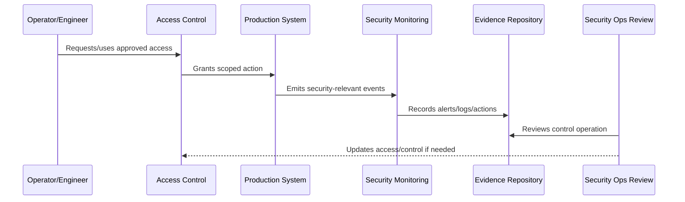

# Secrets and Credential Operations

> *"Defines operational handling for secrets, API keys, provider credentials, tokens, certificates, rotation, revocation, and incident response."*

---

# Purpose

Defines operational handling for secrets, API keys, provider credentials, tokens, certificates, rotation, revocation, and incident response.

---

# Security Operations Problem

Credential leakage can compromise systems even when application logic is secure.

---

# Security Operations Decision

## Decision

CLARA secrets and credentials should be stored in approved secret management systems, rotated on cadence or incident trigger, and never hard-coded.

## Status

Accepted.

---

# Operational Security Rule

Every production security-sensitive operation must be governed as:

```text
Action -> Owner -> Authorization -> Execution -> Audit Evidence -> Monitoring -> Review -> Improvement
```

A production operation is not secure if the team cannot answer:

```text
who is allowed to do it
why access is needed
what approval is required
how action is logged
how misuse is detected
how rollback/containment works
how evidence is retained
how access is reviewed
```

---

# Recommended Security Operations Flow



---

# Production-Ready Checklist

- [ ] Owner is assigned.
- [ ] Required access is defined.
- [ ] Least privilege is applied.
- [ ] Approval path is defined for privileged actions.
- [ ] Audit evidence is captured.
- [ ] Monitoring/detection exists where relevant.
- [ ] Secrets are protected.
- [ ] Runtime configuration is secure.
- [ ] Incident containment path exists.
- [ ] Review cadence is defined.

---

# Acceptance Criteria

- [ ] Security-sensitive operation is clear.
- [ ] Access and approval are clear.
- [ ] Audit evidence is clear.
- [ ] Monitoring and detection expectations are clear.
- [ ] Incident coordination is clear.
- [ ] Review cadence is clear.
- [ ] AI coding assistants can follow this safely.

---

# Anti-patterns

Avoid:

- Shared production accounts.
- Permanent broad admin access.
- Hard-coded secrets.
- Secrets in logs, tickets, docs, or screenshots.
- Deployment from untrusted machines.
- Production debug mode enabled.
- Unreviewed pipeline changes.
- Security alerts with no owner.
- Vulnerability tickets with no due date.
- Destroying evidence during incident response.

---

# Related Documents

- ../PART-10-SLOs-SLIs-and-Error-Budgets/README.md
- ../PART-04-Alerting-and-Incident-Operations/README.md
- ../PART-07-Backup-Restore-and-Disaster-Recovery/README.md
- ../../BOOK-06-Security-Governance-and-Compliance/PART-02-Security-Policies-and-Standards/README.md
- ../../BOOK-06-Security-Governance-and-Compliance/PART-03-Identity-and-Access-Governance/README.md
- ../../BOOK-06-Security-Governance-and-Compliance/PART-08-Incident-Response-and-Business-Continuity-Governance/README.md

---

# Navigation

**Previous:** `123-Production-Access-Controls.md`

**Next:** `125-Secure-Deployment-Operations.md`

---

# Secrets Inventory

Track:

```text
secret name/reference
owner
purpose
environment
provider/system
rotation cadence
last rotated
access roles
incident revocation steps
```

---

# Secret Handling Rules

- Store secrets in approved secret manager.
- Never hard-code secrets.
- Never commit secrets.
- Never paste secrets into tickets/chat/docs.
- Redact secrets from logs.
- Rotate after exposure or owner/provider change.
- Revoke unused credentials.
- Use scoped tokens where possible.

---

# Rotation Triggers

```text
suspected exposure
employee/contractor departure with access concern
provider compromise
incident response
scope change
regular cadence
```

---

# Secret Rule

A secret without owner and rotation path is operational debt.
