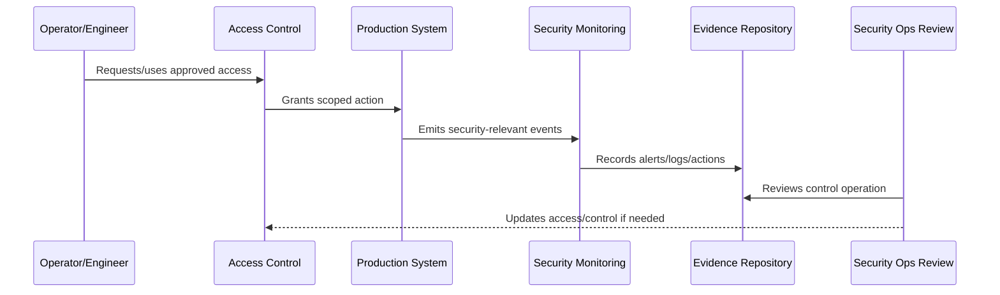

# Secure Deployment Operations

> *"Defines security requirements for deployment pipelines, release approvals, artifact integrity, environment separation, migration safety, and rollback controls."*

---

# Purpose

Defines security requirements for deployment pipelines, release approvals, artifact integrity, environment separation, migration safety, and rollback controls.

---

# Security Operations Problem

The deployment pipeline is a privileged production control plane and must be secured accordingly.

---

# Security Operations Decision

## Decision

CLARA deployment operations should prevent unauthorized, unreviewed, untested, or unsafe changes from reaching production.

## Status

Accepted.

---

# Operational Security Rule

Every production security-sensitive operation must be governed as:

```text
Action -> Owner -> Authorization -> Execution -> Audit Evidence -> Monitoring -> Review -> Improvement
```

A production operation is not secure if the team cannot answer:

```text
who is allowed to do it
why access is needed
what approval is required
how action is logged
how misuse is detected
how rollback/containment works
how evidence is retained
how access is reviewed
```

---

# Recommended Security Operations Flow



---

# Production-Ready Checklist

- [ ] Owner is assigned.
- [ ] Required access is defined.
- [ ] Least privilege is applied.
- [ ] Approval path is defined for privileged actions.
- [ ] Audit evidence is captured.
- [ ] Monitoring/detection exists where relevant.
- [ ] Secrets are protected.
- [ ] Runtime configuration is secure.
- [ ] Incident containment path exists.
- [ ] Review cadence is defined.

---

# Acceptance Criteria

- [ ] Security-sensitive operation is clear.
- [ ] Access and approval are clear.
- [ ] Audit evidence is clear.
- [ ] Monitoring and detection expectations are clear.
- [ ] Incident coordination is clear.
- [ ] Review cadence is clear.
- [ ] AI coding assistants can follow this safely.

---

# Anti-patterns

Avoid:

- Shared production accounts.
- Permanent broad admin access.
- Hard-coded secrets.
- Secrets in logs, tickets, docs, or screenshots.
- Deployment from untrusted machines.
- Production debug mode enabled.
- Unreviewed pipeline changes.
- Security alerts with no owner.
- Vulnerability tickets with no due date.
- Destroying evidence during incident response.

---

# Related Documents

- ../PART-10-SLOs-SLIs-and-Error-Budgets/README.md
- ../PART-04-Alerting-and-Incident-Operations/README.md
- ../PART-07-Backup-Restore-and-Disaster-Recovery/README.md
- ../../BOOK-06-Security-Governance-and-Compliance/PART-02-Security-Policies-and-Standards/README.md
- ../../BOOK-06-Security-Governance-and-Compliance/PART-03-Identity-and-Access-Governance/README.md
- ../../BOOK-06-Security-Governance-and-Compliance/PART-08-Incident-Response-and-Business-Continuity-Governance/README.md

---

# Navigation

**Previous:** `124-Secrets-and-Credential-Operations.md`

**Next:** `126-Runtime-Hardening.md`

---

# Deployment Security Controls

Secure deployment should include:

```text
protected branches
reviewed pull requests
CI checks
secret scanning
dependency scanning where practical
artifact build provenance where practical
environment separation
approval for production release
migration review
rollback plan
release evidence
```

---

# Pipeline Access

CI/CD systems should follow:

```text
least privilege tokens
environment-scoped credentials
no long-lived broad credentials where avoidable
restricted manual approval permissions
audit logs for deployments
```

---

# Deployment Rule

Production deployment is a privileged action, even when automated.
