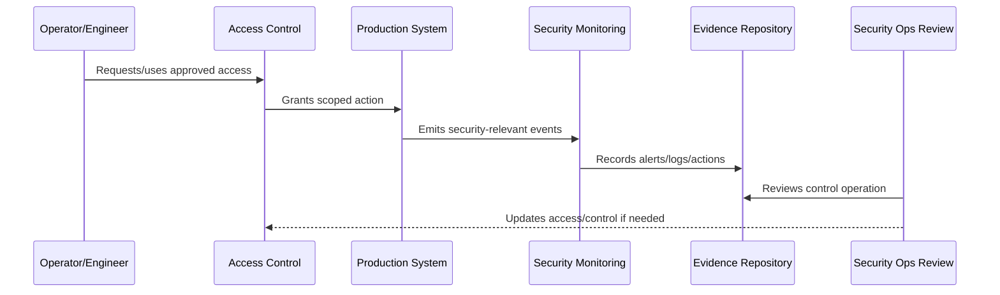

# Part 11 Summary

> *"Summarizes Operational Security and prepares for Book VII Part 12."*

---

# Purpose

Summarizes Operational Security and prepares for Book VII Part 12.

---

# Security Operations Problem

Operations handover comes next because Book VII needs a durable operating manual and master index.

---

# Security Operations Decision

## Decision

CLARA should proceed to Operations Handover and Master Index after defining operational security principles, access controls, secrets operations, secure deployment, runtime hardening, monitoring, vulnerability operations, security incident coordination, audit evidence, and review cadence.

## Status

Accepted.

---

# Operational Security Rule

Every production security-sensitive operation must be governed as:

```text
Action -> Owner -> Authorization -> Execution -> Audit Evidence -> Monitoring -> Review -> Improvement
```

A production operation is not secure if the team cannot answer:

```text
who is allowed to do it
why access is needed
what approval is required
how action is logged
how misuse is detected
how rollback/containment works
how evidence is retained
how access is reviewed
```

---

# Recommended Security Operations Flow



---

# Production-Ready Checklist

- [ ] Owner is assigned.
- [ ] Required access is defined.
- [ ] Least privilege is applied.
- [ ] Approval path is defined for privileged actions.
- [ ] Audit evidence is captured.
- [ ] Monitoring/detection exists where relevant.
- [ ] Secrets are protected.
- [ ] Runtime configuration is secure.
- [ ] Incident containment path exists.
- [ ] Review cadence is defined.

---

# Acceptance Criteria

- [ ] Security-sensitive operation is clear.
- [ ] Access and approval are clear.
- [ ] Audit evidence is clear.
- [ ] Monitoring and detection expectations are clear.
- [ ] Incident coordination is clear.
- [ ] Review cadence is clear.
- [ ] AI coding assistants can follow this safely.

---

# Anti-patterns

Avoid:

- Shared production accounts.
- Permanent broad admin access.
- Hard-coded secrets.
- Secrets in logs, tickets, docs, or screenshots.
- Deployment from untrusted machines.
- Production debug mode enabled.
- Unreviewed pipeline changes.
- Security alerts with no owner.
- Vulnerability tickets with no due date.
- Destroying evidence during incident response.

---

# Related Documents

- ../PART-10-SLOs-SLIs-and-Error-Budgets/README.md
- ../PART-04-Alerting-and-Incident-Operations/README.md
- ../PART-07-Backup-Restore-and-Disaster-Recovery/README.md
- ../../BOOK-06-Security-Governance-and-Compliance/PART-02-Security-Policies-and-Standards/README.md
- ../../BOOK-06-Security-Governance-and-Compliance/PART-03-Identity-and-Access-Governance/README.md
- ../../BOOK-06-Security-Governance-and-Compliance/PART-08-Incident-Response-and-Business-Continuity-Governance/README.md

---

# Navigation

**Previous:** `131-Security-Operations-Review-Cadence.md`

**Next:** `../PART-12-Operations-Handover-and-Master-Index/README.md`

---

# Part 11 Completion

Part 11 establishes:

- Operational Security overview.
- Operational Security principles.
- Production access controls.
- Secrets and credential operations.
- Secure deployment operations.
- Runtime hardening.
- Security monitoring and detection operations.
- Vulnerability and patch operations.
- Security incident coordination.
- Operational audit evidence.
- Security operations review cadence.

---

# Ready for Part 12

The next part should be:

```text
BOOK VII — PART 12: Operations Handover and Master Index
```

It should define:

- Operations handover overview.
- Service ownership handover.
- Observability handover.
- Alerting/incident handover.
- Reliability and SLO handover.
- Support operations handover.
- Runbook handover.
- Operational security handover.
- Book VII closure.
- Book VII master index.
