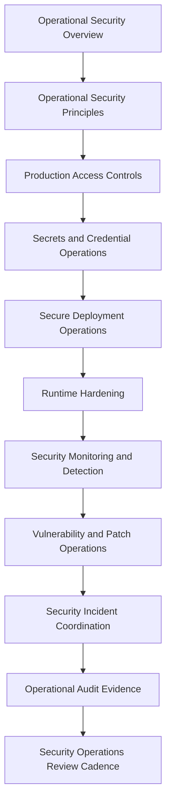

# PART-11 — Operational Security

> *"Operational security protects the way production is accessed, changed, monitored, and recovered."*

---

# Purpose

Part 11 defines CLARA's operational security model.

It covers:

- Operational Security overview.
- Operational Security Principles.
- Production Access Controls.
- Secrets and Credential Operations.
- Secure Deployment Operations.
- Runtime Hardening.
- Security Monitoring and Detection Operations.
- Vulnerability and Patch Operations.
- Security Incident Coordination.
- Operational Audit Evidence.
- Security Operations Review Cadence.

---

# Chapter Map

| Chapter | Title |
|---:|---|
| 121 | Operational Security Overview |
| 122 | Operational Security Principles |
| 123 | Production Access Controls |
| 124 | Secrets and Credential Operations |
| 125 | Secure Deployment Operations |
| 126 | Runtime Hardening |
| 127 | Security Monitoring and Detection Operations |
| 128 | Vulnerability and Patch Operations |
| 129 | Security Incident Coordination |
| 130 | Operational Audit Evidence |
| 131 | Security Operations Review Cadence |
| 132 | Part 11 Summary |

---

# Operational Security Map



---

# Operational Security Non-Negotiables

CLARA operational security must enforce:

```text
least privilege production access
audited privileged actions
break-glass process
service account ownership
secret manager usage
credential rotation and revocation
secure deployment pipeline
environment separation
runtime hardening
security monitoring and detection
vulnerability ownership and remediation
security incident coordination
operational audit evidence
review cadence
```

---

# Relationship to Previous Parts

Part 10 defines SLOs, SLIs, and error budgets.

Part 11 defines how production operations stay secure while teams deploy, access, monitor, patch, investigate, and recover CLARA.

---

# Navigation

**Previous:** `../PART-10-SLOs-SLIs-and-Error-Budgets/120-Part-10-Summary.md`

**Next:** `121-Operational-Security-Overview.md`
