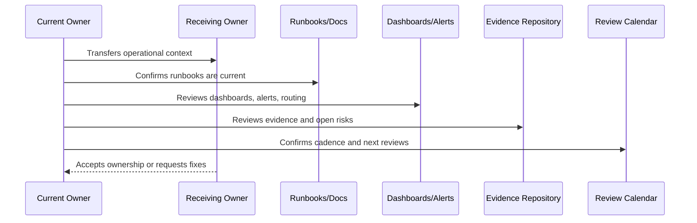

# Service Ownership Handover

> *"Defines how critical services, capabilities, workflows, dependencies, owners, backups, escalation paths, and service health signals are transferred."*

---

# Purpose

Defines how critical services, capabilities, workflows, dependencies, owners, backups, escalation paths, and service health signals are transferred.

---

# Handover Problem

A service without clear ownership becomes nobody's responsibility during incidents.

---

# Operations Decision

## Decision

Every critical CLARA service should have explicit primary owner, backup owner, health dashboard, alert routing, runbook, and known risks before handover is accepted.

## Status

Accepted.

---

# Operations Handover Rule

Every operational area must be handed over as:

```text
Area -> Owner -> Backup Owner -> Current State -> Evidence -> Open Risks -> Runbooks -> Review Cadence -> Escalation Path
```

A handover is incomplete if the receiving team cannot answer:

```text
what they own
how to observe it
how to respond to alerts
how to recover it
how to support customers
how to secure operations
where evidence lives
what is currently risky
what must be reviewed next
```

---

# Recommended Handover Flow



---

# Production Handover Checklist

- [ ] Primary owner is assigned.
- [ ] Backup owner is assigned.
- [ ] Service/capability status is documented.
- [ ] Dashboards and alerts are linked.
- [ ] Runbooks/playbooks are linked.
- [ ] Known risks and issues are documented.
- [ ] SLO/error budget state is documented where applicable.
- [ ] Support escalation path is documented.
- [ ] Security/access boundaries are documented.
- [ ] Evidence and review cadence are documented.

---

# Acceptance Criteria

- [ ] Operational ownership is transferable.
- [ ] Observability is understandable.
- [ ] Alerts and incidents are actionable.
- [ ] Runbooks are current enough to operate.
- [ ] Support and customer impact process is clear.
- [ ] Operational security is preserved.
- [ ] AI coding assistants can follow this safely.

---

# Anti-patterns

Avoid:

- Handover as a ZIP/folder dump only.
- Dashboards with no explanation.
- Alerts with outdated routing.
- Services with no owner.
- Runbooks with stale commands.
- SLOs with no owner or dashboard.
- Support escalation paths that point to old owners.
- Secrets/access not reviewed during handover.
- Known issues not transferred.
- Evidence locked under one person's private account.

---

# Related Documents

- ../PART-01-Operations-Foundation/README.md
- ../PART-02-Observability-Strategy/README.md
- ../PART-04-Alerting-and-Incident-Operations/README.md
- ../PART-09-Runbooks-and-Playbooks/README.md
- ../PART-10-SLOs-SLIs-and-Error-Budgets/README.md
- ../PART-11-Operational-Security/README.md
- ../../BOOK-06-Security-Governance-and-Compliance/PART-12-Governance-Handover-and-Operating-Manual/README.md

---

# Navigation

**Previous:** `134-Operations-Handover-Checklist.md`

**Next:** `136-Observability-Handover.md`

---

# Service Ownership Handover Record

```markdown
## Service Ownership Handover

Service:
Business purpose:
Criticality:
Primary owner:
Backup owner:
Dependencies:
Dashboards:
Alerts:
Runbook:
SLO:
Known risks:
Recent incidents:
Support escalation:
Next review:
```

---

# Critical Service Examples

```text
authentication
inbox/conversations
reply sending
ticket workflow
knowledge search
AI Gateway
Integration Gateway
webhook ingestion
database
queue/workers
file storage
audit logging
exports
```

---

# Ownership Rule

No critical service should enter production without primary owner, backup owner, dashboard, alert route, and runbook.
