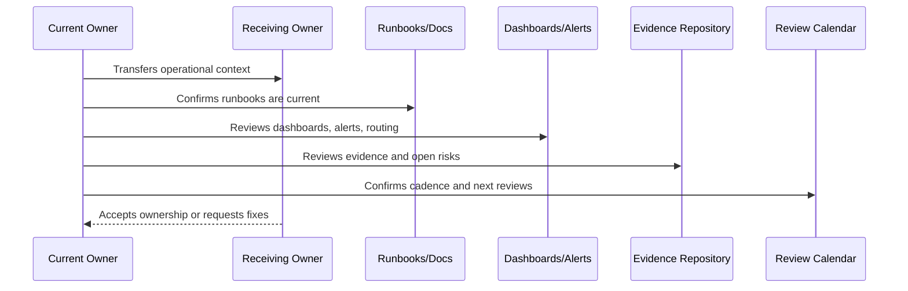

# Runbook and Playbook Handover

> *"Defines handover for service runbooks, incident playbooks, AI runbooks, integration runbooks, database/queue runbooks, support playbooks, and recovery playbooks."*

---

# Purpose

Defines handover for service runbooks, incident playbooks, AI runbooks, integration runbooks, database/queue runbooks, support playbooks, and recovery playbooks.

---

# Handover Problem

Runbooks that are handed over without validation can be dangerous during production pressure.

---

# Operations Decision

## Decision

CLARA runbook handover should verify that operational procedures are current, owned, tested where critical, and accessible to responders.

## Status

Accepted.

---

# Operations Handover Rule

Every operational area must be handed over as:

```text
Area -> Owner -> Backup Owner -> Current State -> Evidence -> Open Risks -> Runbooks -> Review Cadence -> Escalation Path
```

A handover is incomplete if the receiving team cannot answer:

```text
what they own
how to observe it
how to respond to alerts
how to recover it
how to support customers
how to secure operations
where evidence lives
what is currently risky
what must be reviewed next
```

---

# Recommended Handover Flow



---

# Production Handover Checklist

- [ ] Primary owner is assigned.
- [ ] Backup owner is assigned.
- [ ] Service/capability status is documented.
- [ ] Dashboards and alerts are linked.
- [ ] Runbooks/playbooks are linked.
- [ ] Known risks and issues are documented.
- [ ] SLO/error budget state is documented where applicable.
- [ ] Support escalation path is documented.
- [ ] Security/access boundaries are documented.
- [ ] Evidence and review cadence are documented.

---

# Acceptance Criteria

- [ ] Operational ownership is transferable.
- [ ] Observability is understandable.
- [ ] Alerts and incidents are actionable.
- [ ] Runbooks are current enough to operate.
- [ ] Support and customer impact process is clear.
- [ ] Operational security is preserved.
- [ ] AI coding assistants can follow this safely.

---

# Anti-patterns

Avoid:

- Handover as a ZIP/folder dump only.
- Dashboards with no explanation.
- Alerts with outdated routing.
- Services with no owner.
- Runbooks with stale commands.
- SLOs with no owner or dashboard.
- Support escalation paths that point to old owners.
- Secrets/access not reviewed during handover.
- Known issues not transferred.
- Evidence locked under one person's private account.

---

# Related Documents

- ../PART-01-Operations-Foundation/README.md
- ../PART-02-Observability-Strategy/README.md
- ../PART-04-Alerting-and-Incident-Operations/README.md
- ../PART-09-Runbooks-and-Playbooks/README.md
- ../PART-10-SLOs-SLIs-and-Error-Budgets/README.md
- ../PART-11-Operational-Security/README.md
- ../../BOOK-06-Security-Governance-and-Compliance/PART-12-Governance-Handover-and-Operating-Manual/README.md

---

# Navigation

**Previous:** `139-Support-Operations-Handover.md`

**Next:** `141-Operational-Security-Handover.md`

---

# Runbook Handover Checklist

- [ ] Runbook index exists.
- [ ] Critical service runbooks exist.
- [ ] Incident playbooks exist.
- [ ] AI runbooks exist.
- [ ] Integration runbooks exist.
- [ ] Database/queue runbooks exist.
- [ ] Support playbooks exist.
- [ ] Recovery/DR playbooks exist.
- [ ] Owners are current.
- [ ] Last reviewed dates are current.
- [ ] Critical runbooks are tested where practical.

---

# Runbook Validation Questions

```text
Can a new responder follow it?
Are commands current?
Are dangerous steps marked?
Are required permissions clear?
Are validation steps clear?
Is escalation clear?
```

---

# Runbook Rule

A stale runbook is worse than no runbook because it creates false confidence.
