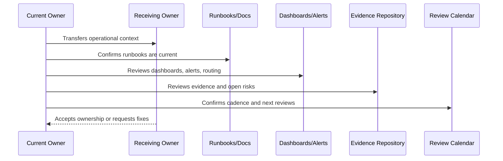

# Book VII Closure

> *"Closes Book VII and explains how Operations, Observability, and Reliability should be used with previous books and future implementation work."*

---

# Purpose

Closes Book VII and explains how Operations, Observability, and Reliability should be used with previous books and future implementation work.

---

# Handover Problem

If Book VII is not used during production readiness and operations, reliability practices will drift away from implementation reality.

---

# Operations Decision

## Decision

Book VII should become CLARA's production operations reference for running, observing, supporting, securing, and improving the system.

## Status

Accepted.

---

# Operations Handover Rule

Every operational area must be handed over as:

```text
Area -> Owner -> Backup Owner -> Current State -> Evidence -> Open Risks -> Runbooks -> Review Cadence -> Escalation Path
```

A handover is incomplete if the receiving team cannot answer:

```text
what they own
how to observe it
how to respond to alerts
how to recover it
how to support customers
how to secure operations
where evidence lives
what is currently risky
what must be reviewed next
```

---

# Recommended Handover Flow



---

# Production Handover Checklist

- [ ] Primary owner is assigned.
- [ ] Backup owner is assigned.
- [ ] Service/capability status is documented.
- [ ] Dashboards and alerts are linked.
- [ ] Runbooks/playbooks are linked.
- [ ] Known risks and issues are documented.
- [ ] SLO/error budget state is documented where applicable.
- [ ] Support escalation path is documented.
- [ ] Security/access boundaries are documented.
- [ ] Evidence and review cadence are documented.

---

# Acceptance Criteria

- [ ] Operational ownership is transferable.
- [ ] Observability is understandable.
- [ ] Alerts and incidents are actionable.
- [ ] Runbooks are current enough to operate.
- [ ] Support and customer impact process is clear.
- [ ] Operational security is preserved.
- [ ] AI coding assistants can follow this safely.

---

# Anti-patterns

Avoid:

- Handover as a ZIP/folder dump only.
- Dashboards with no explanation.
- Alerts with outdated routing.
- Services with no owner.
- Runbooks with stale commands.
- SLOs with no owner or dashboard.
- Support escalation paths that point to old owners.
- Secrets/access not reviewed during handover.
- Known issues not transferred.
- Evidence locked under one person's private account.

---

# Related Documents

- ../PART-01-Operations-Foundation/README.md
- ../PART-02-Observability-Strategy/README.md
- ../PART-04-Alerting-and-Incident-Operations/README.md
- ../PART-09-Runbooks-and-Playbooks/README.md
- ../PART-10-SLOs-SLIs-and-Error-Budgets/README.md
- ../PART-11-Operational-Security/README.md
- ../../BOOK-06-Security-Governance-and-Compliance/PART-12-Governance-Handover-and-Operating-Manual/README.md

---

# Navigation

**Previous:** `142-Operations-Review-Cadence-and-Evidence-Handover.md`

**Next:** `144-Part-12-Summary.md`

---

# How Book VII Should Be Used

Book VII should be used during:

```text
production readiness reviews
release planning
observability implementation
alert creation
incident response
reliability reviews
capacity planning
backup/restore drills
support operations
runbook reviews
SLO/error budget reviews
operational security reviews
```

---

# Book VII Closure Criteria

Book VII is complete when CLARA has defined:

```text
operations foundation
observability strategy
logging and metrics
alerting and incident operations
reliability engineering
performance and capacity
backup/restore/DR
production support
runbooks and playbooks
SLOs/SLIs/error budgets
operational security
operations handover
```

---

# Update Rule

Update Book VII when:

```text
production architecture changes
new critical workflow launches
new dependency/provider is added
new AI capability launches
incident reveals operational gap
SLOs change
runbooks change
support process changes
security operations change
```
