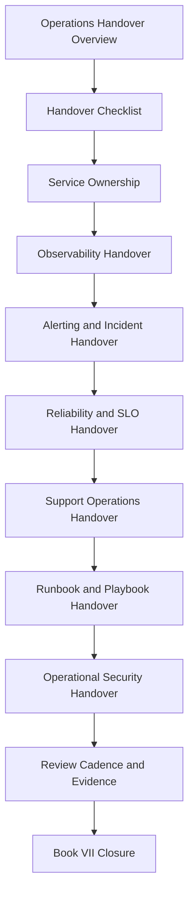

# PART-12 — Operations Handover and Master Index

> *"Operations are complete only when the next team can run production safely without guessing."*

---

# Purpose

Part 12 defines CLARA's operations handover and Book VII closure.

It covers:

- Operations Handover and Master Index overview.
- Operations Handover Checklist.
- Service Ownership Handover.
- Observability Handover.
- Alerting and Incident Handover.
- Reliability and SLO Handover.
- Support Operations Handover.
- Runbook and Playbook Handover.
- Operational Security Handover.
- Operations Review Cadence and Evidence Handover.
- Book VII Closure.

---

# Chapter Map

| Chapter | Title |
|---:|---|
| 133 | Operations Handover and Master Index Overview |
| 134 | Operations Handover Checklist |
| 135 | Service Ownership Handover |
| 136 | Observability Handover |
| 137 | Alerting and Incident Handover |
| 138 | Reliability and SLO Handover |
| 139 | Support Operations Handover |
| 140 | Runbook and Playbook Handover |
| 141 | Operational Security Handover |
| 142 | Operations Review Cadence and Evidence Handover |
| 143 | Book VII Closure |
| 144 | Part 12 Summary |

---

# Operations Handover Map



---

# Book VII Parts

| Part | Title |
|---:|---|
| 01 | Operations Foundation |
| 02 | Observability Strategy |
| 03 | Logging and Metrics |
| 04 | Alerting and Incident Operations |
| 05 | Reliability Engineering |
| 06 | Performance and Capacity |
| 07 | Backup, Restore, and Disaster Recovery |
| 08 | Production Support Operations |
| 09 | Runbooks and Playbooks |
| 10 | SLOs, SLIs, and Error Budgets |
| 11 | Operational Security |
| 12 | Operations Handover and Master Index |

---

# Handover Non-Negotiables

CLARA operations handover must include:

```text
service ownership
backup owners
dashboards
alerts
runbooks
incident paths
SLOs and error budget status
reliability risks
support escalation paths
known issues
backup/restore evidence
operational security controls
open vulnerabilities
production access review
review cadence
evidence locations
```

---

# Navigation

**Previous:** `../PART-11-Operational-Security/132-Part-11-Summary.md`

**Next:** `133-Operations-Handover-and-Master-Index-Overview.md`
