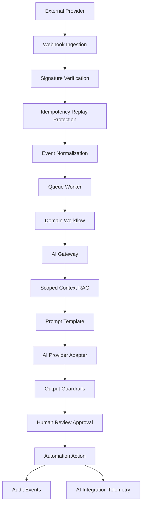

# BOOK-08 AI Automation Integration Map

> *"AI, automation, and integrations are powerful because they act on external context. That is also why they need strong guardrails."*

---

# Purpose

This document maps AI Gateway, automation, and external integration implementation.

---

# AI + Integration Flow



---

# AI Gateway Responsibilities

```text
centralize model/provider access
version prompts
scope context/RAG
enforce safety guardrails
track cost/tokens
support human review
support fallback/degraded mode
support kill switches
```

---

# Integration Responsibilities

```text
isolate provider adapters
verify webhooks
prevent replay
process events idempotently
normalize external payloads
handle retries and rate limits
capture DLQ events
emit operational dashboards
```

---

# Automation Responsibilities

```text
define trigger and conditions
check scope and policy
require approval where needed
execute idempotently
emit audit events
support retry/rollback/degraded mode
support kill switch
```

---

# AI/Integration Rule

External input, retrieved context, and model output are all untrusted until verified, scoped, validated, and approved where required.
