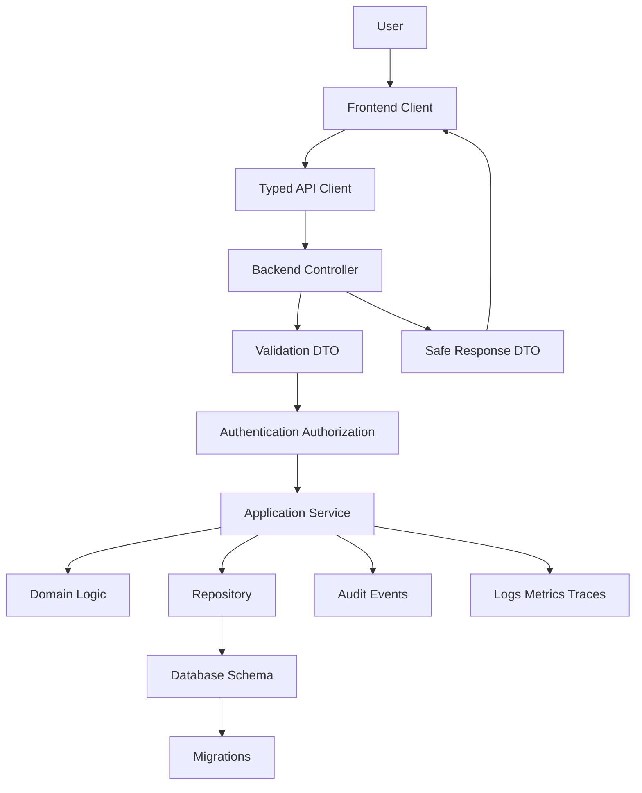

# BOOK-08 Backend Frontend Database Map

> *"Backend, frontend, and database must agree on contracts, permissions, and state."*

---

# Purpose

This document maps the relationship between backend implementation, frontend/client implementation, and database/migration implementation.

---

# System Implementation Flow



---

# Backend Responsibilities

```text
validate external input
authenticate actor
authorize sensitive operations
orchestrate use cases
enforce domain rules
access data safely
emit audit/observability events
return safe DTOs
```

---

# Frontend Responsibilities

```text
render user workflows
manage UI and server state separately
use API client contracts
show permission-aware UI
handle loading/error/empty/degraded states
avoid storing secrets
emit privacy-safe telemetry
```

---

# Database Responsibilities

```text
protect durable state
enforce constraints
preserve tenant/workspace boundaries
support safe migrations
support transactions/idempotency
support indexing/performance
support audit/retention/restore
```

---

# Cross-Layer Security Rule

Frontend permission checks improve UX.

Backend authorization enforces security.

Database scoping protects data integrity.

All three should work together.
