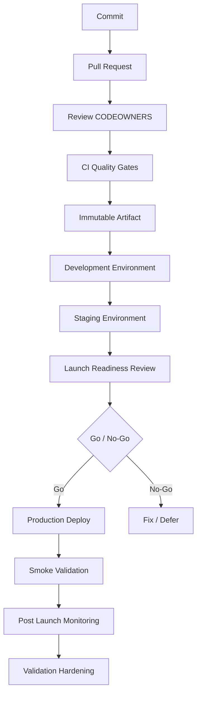

# BOOK-08 CI/CD and Launch Map

> *"Delivery is not complete when code is merged. Delivery is complete when production is validated and owned."*

---

# Purpose

This document maps CI/CD, environments, production launch, and post-launch validation.

---

# Delivery to Launch Flow



---

# CI/CD Responsibilities

```text
protect branches
run quality gates
scan dependencies and secrets
build immutable artifacts
promote artifacts through environments
inject secrets safely
run migrations safely
support feature flags
support rollback/hotfix
capture audit evidence
```

---

# Launch Responsibilities

```text
define release candidate
freeze scope
verify readiness
assign owners
execute launch day plan
monitor production
communicate status
trigger rollback when needed
capture evidence
```

---

# Launch Rule

A deploy is technical. A launch is operational, security, support, and customer responsibility.
