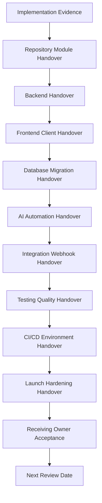

# BOOK-08 Handover Map

> *"A system is not truly implemented until future owners can safely change it."*

---

# Purpose

This document maps Book VIII implementation handover responsibilities.

---

# Handover Flow



---

# Handover Package

Every handover should include:

```text
owner and backup owner
scope and boundaries
code location
test commands
deployment path
security notes
observability links
runbooks/support links
known risks
hardening backlog
evidence links
next review date
```

---

# Handover Acceptance Checklist

- [ ] Receiving owner can find the code.
- [ ] Receiving owner can run tests.
- [ ] Receiving owner understands deployment path.
- [ ] Receiving owner understands security boundaries.
- [ ] Receiving owner understands observability and runbooks.
- [ ] Known risks are explicit.
- [ ] Open hardening items are owned.
- [ ] Acceptance is recorded.

---

# Handover Rule

“Ask the original developer” is not a production handover strategy.
