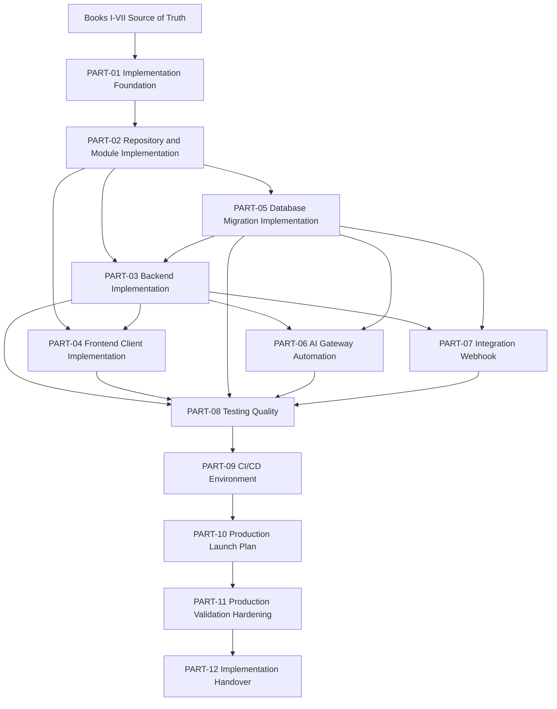

# BOOK-08 Implementation Dependency Map

> *"Implementation must follow dependency order, not developer excitement."*

---

# Purpose

This document maps implementation dependencies across Book VIII.

---

# Dependency Flow



---

# Required Dependency Order

Recommended order:

```text
1 implementation principles
2 repository skeleton
3 module boundaries
4 backend/database foundation
5 frontend/client implementation
6 AI/integration implementation
7 testing and quality gates
8 CI/CD and environments
9 production launch
10 production validation and hardening
11 handover
```

---

# Dependency Rule

Do not implement high-risk production features before the lower-level guardrails exist.

Examples:

```text
do not launch AI automation before human review and kill switch exist
do not enable production webhooks before signature verification and idempotency exist
do not deploy database migrations before migration safety workflow exists
do not expose customer workflows before authz tests and support readiness exist
```

---

# Implementation Acceptance Checklist

- [ ] Source documentation is known.
- [ ] Module boundary is known.
- [ ] Owner is assigned.
- [ ] Security boundary is defined.
- [ ] Tests are identified.
- [ ] CI/CD gate is planned.
- [ ] Observability is planned.
- [ ] Launch/handover impact is known.
