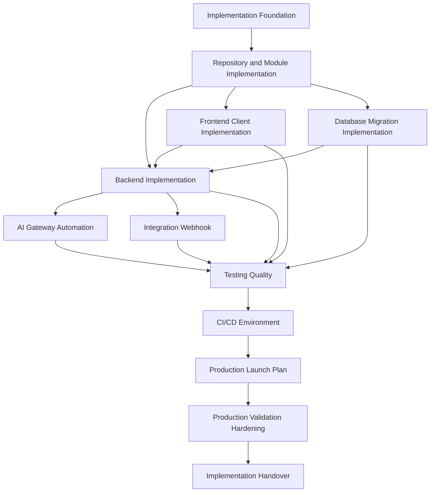

# BOOK-08 Master Index

> *"Implementation is where architecture, security, operations, and delivery meet production reality."*

---

# Book Identity

```text
Book: Book VIII
Title: Implementation, Delivery & Production Launch
Project: CLARA
Status: Complete
Version: 1.0.0
Chapters: 01–144
Parts: 12
```

---

# Purpose

Book VIII defines how CLARA should be implemented, delivered, launched, validated, hardened, and handed over.

It connects:

```text
implementation foundation
repository and module structure
backend implementation
frontend/client implementation
database and migration implementation
AI Gateway and automation
integration and webhook implementation
testing and quality
CI/CD and environments
production launch
production validation and hardening
implementation handover
```

---

# Book VIII Part Index

| Part | Title | Chapters | Link | Purpose |
|---|---|---:|---|---|
| PART-01 | Implementation Foundation | 01–12 | [PART-01-Implementation-Foundation/README.md](../PART-01-Implementation-Foundation/README.md) | Defines implementation principles, repo strategy, stack/runtime decisions, ownership, coding standards, secure coding, environments, local dev, review gates, and AI assistant rules. |
| PART-02 | Repository and Module Implementation | 13–24 | [PART-02-Repository-and-Module-Implementation/README.md](../PART-02-Repository-and-Module-Implementation/README.md) | Defines root skeleton, docs, workspace strategy, apps/services/packages layout, backend/frontend/worker modules, shared packages, tests, scripts, and tooling. |
| PART-03 | Backend Implementation | 25–36 | [PART-03-Backend-Implementation/README.md](../PART-03-Backend-Implementation/README.md) | Defines API bootstrap, routing/controllers, validation/DTOs, application services, domain logic, repositories, authentication, authorization, errors, observability, and backend tests. |
| PART-04 | Frontend and Client Implementation | 37–48 | [PART-04-Frontend-and-Client-Implementation/README.md](../PART-04-Frontend-and-Client-Implementation/README.md) | Defines frontend bootstrap, routing/layouts, components, state management, API clients, forms, auth/permission UI, UX states, security, telemetry, and tests. |
| PART-05 | Database and Migration Implementation | 49–60 | [PART-05-Database-and-Migration-Implementation/README.md](../PART-05-Database-and-Migration-Implementation/README.md) | Defines schemas, migration workflow, seed/fixtures, repository integration, tenant/workspace scoping, indexing, transactions, audit/retention, backup/restore, DB security, and tests. |
| PART-06 | AI Gateway and Automation Implementation | 61–72 | [PART-06-AI-Gateway-and-Automation-Implementation/README.md](../PART-06-AI-Gateway-and-Automation-Implementation/README.md) | Defines AI Gateway, provider adapters, prompts/templates, RAG/context, guardrails, human review, observability/cost/quality, automation, fallback/kill switches, and AI tests. |
| PART-07 | Integration and Webhook Implementation | 73–84 | [PART-07-Integration-and-Webhook-Implementation/README.md](../PART-07-Integration-and-Webhook-Implementation/README.md) | Defines provider adapters, webhook ingestion, signature verification, idempotency, event normalization, rate limits/retries, DLQ, observability, security, and sandbox tests. |
| PART-08 | Testing and Quality Implementation | 85–96 | [PART-08-Testing-and-Quality-Implementation/README.md](../PART-08-Testing-and-Quality-Implementation/README.md) | Defines unit, integration, contract, e2e, security, performance, AI quality tests, fixtures, CI quality gates, coverage, and release regression. |
| PART-09 | CI/CD and Environment Implementation | 97–108 | [PART-09-CI-CD-and-Environment-Implementation/README.md](../PART-09-CI-CD-and-Environment-Implementation/README.md) | Defines branching, pipeline quality gates, build artifacts, environment promotion, secrets/config, migration deployment, feature flags, deployment strategies, rollback, and pipeline security. |
| PART-10 | Production Launch Plan | 109–120 | [PART-10-Production-Launch-Plan/README.md](../PART-10-Production-Launch-Plan/README.md) | Defines launch readiness, release candidate, pre-launch checklist, security/compliance, operations/support, data, integrations, AI, launch execution, communication, and monitoring. |
| PART-11 | Production Validation and Hardening | 121–132 | [PART-11-Production-Validation-and-Hardening/README.md](../PART-11-Production-Validation-and-Hardening/README.md) | Defines smoke validation, telemetry review, incident/defect triage, security/performance/reliability hardening, AI/integration hardening, feedback loop, retrospective, and roadmap. |
| PART-12 | Implementation Handover and Master Index | 133–144 | [PART-12-Implementation-Handover-and-Master-Index/README.md](../PART-12-Implementation-Handover-and-Master-Index/README.md) | Defines repository, backend, frontend, database, AI, integration, testing, CI/CD, launch/hardening handover, Book VIII closure, and master index preparation. |

---

# Master Implementation Model



---

# How to Use Book VIII

Use Book VIII when:

```text
starting implementation
setting up repository structure
writing backend services
building frontend/client workflows
designing database schemas and migrations
implementing AI Gateway and automation
building external integrations/webhooks
creating tests and quality gates
configuring CI/CD and environments
planning production launch
validating and hardening production
transferring ownership after launch
```

---

# Production-Ready Implementation Definition

A CLARA implementation is production-ready only when it has:

```text
clear repository/module location
owner and backup owner
validated inputs
authentication/authorization
safe data access
tests
observability
security controls
CI/CD quality gates
deployment path
rollback/mitigation path
support/runbook references
handover evidence
```

---

# Operating Principle

```text
If code can affect production, it must be testable, secure, observable, deployable, reversible, and owned.
```

---

# Next

Continue to:

```text
BOOK-08-CHAPTER-MAP.md
```
