# BOOK-08 Repository and Module Map

> *"A clean repository makes safe implementation easier and unsafe shortcuts more obvious."*

---

# Purpose

This document maps CLARA repository and module implementation decisions.

---

# Repository Map

```mermaid
flowchart TD
    Root[clara/] --> Docs[docs/]
    Root --> Apps[apps/]
    Root --> Services[services/]
    Root --> Workers[workers/]
    Root --> Packages[packages/]
    Root --> Infra[infra/]
    Root --> Scripts[scripts/]
    Root --> Tests[tests/]
    Root --> Tools[tools/]
    Root --> Github[.github/]
    Root --> Agents[AGENTS.md]

    Apps --> Web[apps/web]
    Apps --> Admin[apps/admin]

    Services --> API[services/api]
    Services --> Auth[services/auth]
    Services --> AIGateway[services/ai-gateway]
    Services --> IntegrationGateway[services/integration-gateway]

    Workers --> MessageWorker[workers/message-worker]
    Workers --> AIWorker[workers/ai-worker]
    Workers --> IntegrationWorker[workers/integration-worker]
    Workers --> ExportWorker[workers/export-worker]

    Packages --> Contracts[packages/contracts]
    Packages --> Config[packages/config]
    Packages --> DB[packages/database]
    Packages --> Logger[packages/logger]
    Packages --> Security[packages/security]
    Packages --> Observability[packages/observability]
    Packages --> Validation[packages/validation]
    Packages --> TestUtils[packages/test-utils]
```



---

# Module Boundary Principles

```text
apps are deployable user-facing apps
services are deployable backend services
workers are deployable async processors
packages are shared libraries/contracts/utilities
infra contains infrastructure/deployment definitions
scripts automate safe local/CI tasks
tests contain cross-cutting tests and fixtures
docs contain source-of-truth documentation
```

---

# Ownership Requirements

Every module should define:

```text
owner
backup owner
purpose
public interface
allowed dependencies
forbidden dependencies
test command
deployment path if deployable
security considerations
runbook link where relevant
```

---

# Repository Security Rules

```text
do not commit secrets
do not commit production customer data
do not scatter provider SDK calls across domain modules
do not let shared packages become dumping grounds
do not let scripts target production by default
```
