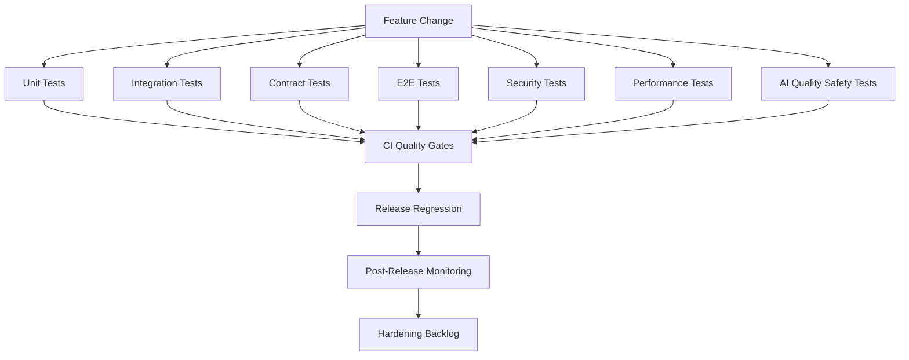

# BOOK-08 Testing Quality Map

> *"Quality is not one test type. Quality is a layered defense against production failure."*

---

# Purpose

This document maps the testing and quality system across Book VIII.

---

# Quality System Map



---

# Test Layer Responsibilities

```text
unit tests protect business rules
integration tests protect module/dependency behavior
contract tests protect boundaries
e2e tests protect critical user journeys
security tests protect abuse cases
performance tests protect budgets and capacity
AI quality tests protect prompts, RAG, guardrails, and cost
release regression protects launch confidence
```

---

# Required Quality Gates

```text
format
lint
typecheck
unit tests
integration tests
contract tests
migration check
security scan
secret scan
build
selected e2e smoke
AI regression where prompt/AI behavior changes
```

---

# Quality Rule

A gate that protects production-critical behavior must be blocking.
