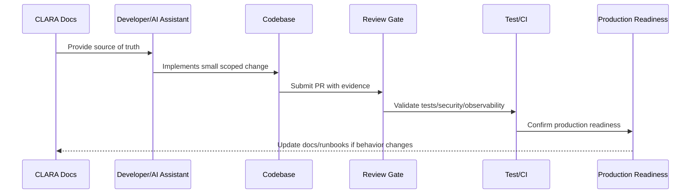

# Implementation Overview

> *"Introduces CLARA's implementation foundation for turning architecture, security, governance, and operations documentation into production-ready code."*

---

# Purpose

Introduces CLARA's implementation foundation for turning architecture, security, governance, and operations documentation into production-ready code.

---

# Implementation Problem

A project can have strong architecture documents but still fail during implementation if coding, repo, security, and delivery standards are not defined early.

---

# Implementation Decision

## Decision

CLARA implementation should begin only after engineering teams align on repository structure, stack decisions, module boundaries, coding standards, security baseline, environment strategy, and review gates.

## Status

Accepted.

---

# Production Implementation Rule

Every CLARA implementation decision should be evaluated against:

```text
correctness
maintainability
security
testability
observability
reliability
operability
developer experience
future change cost
```

A code change is not production-ready if it cannot answer:

```text
what requirement it implements
what module owns it
what inputs it validates
what authorization it enforces
what tests protect it
what logs/metrics help operate it
what failure mode it handles
what documentation it follows
```

---

# Recommended Implementation Flow



---

# Production-Ready Checklist

- [ ] Requirement source is identified.
- [ ] Module ownership is clear.
- [ ] Input validation is implemented.
- [ ] Authorization boundary is enforced.
- [ ] Error handling is safe and explicit.
- [ ] Logs do not expose secrets or sensitive data.
- [ ] Tests cover happy path and important failures.
- [ ] Observability is added where relevant.
- [ ] Documentation/runbook impact is checked.
- [ ] Review gate is passed.

---

# Acceptance Criteria

- [ ] Implementation rule is clear.
- [ ] Security baseline is preserved.
- [ ] Code remains maintainable.
- [ ] Tests and review expectations are clear.
- [ ] AI coding assistants can apply this safely.
- [ ] Production readiness impact is understood.

---

# Anti-patterns

Avoid:

- Coding before reading relevant docs.
- Hard-coding secrets or environment values.
- Mixing business logic into UI/controller layers.
- Skipping authorization because authentication exists.
- Logging raw payloads by default.
- Large unreviewable changes.
- AI-generated code with no tests.
- Bypassing module boundaries.
- Adding dependencies without reason.
- Treating local success as production readiness.

---

# Related Documents

- ../../BOOK-07-Operations-Observability-and-Reliability/BOOK-07-Master-Index/README.md
- ../../BOOK-06-Security-Governance-and-Compliance/BOOK-06-Master-Index/README.md
- ../../BOOK-05-Engineering-Execution-Plan/README.md
- ../../BOOK-03-Architecture-and-Engineering/README.md
- ../../BOOK-04-Data-API-AI-and-Integration-Design/README.md

---

# Navigation

**Previous:** `../BOOK-07-Operations-Observability-and-Reliability/BOOK-07-Master-Index/BOOK-07-NEXT-STEPS.md`

**Next:** `02-Implementation-Principles.md`

---

# Book VIII Scope

Book VIII covers implementation and launch:

```text
repository implementation
module implementation
backend implementation
frontend/client implementation
database migrations
AI Gateway implementation
integration/webhook implementation
testing implementation
CI/CD implementation
production launch plan
production validation
handover
```

---

# Implementation Readiness Questions

```text
Do we know the stack?
Do we know the repo structure?
Do we know module boundaries?
Do we know security baseline?
Do we know test strategy?
Do we know environment strategy?
Do we know deployment path?
Do we know production readiness gates?
```

---

# Implementation Warning

Do not let coding speed outrun architecture, security, and operations readiness.
