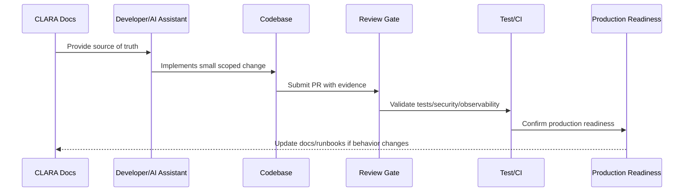

# Repository Strategy

> *"Defines the initial repository strategy, folder layout philosophy, documentation placement, module boundaries, and long-term maintainability rules."*

---

# Purpose

Defines the initial repository strategy, folder layout philosophy, documentation placement, module boundaries, and long-term maintainability rules.

---

# Implementation Problem

Messy repositories slow development, confuse AI coding assistants, and increase the risk of insecure shortcuts.

---

# Implementation Decision

## Decision

CLARA should use a repository structure that makes ownership, boundaries, docs, environments, tests, scripts, and deployment assets easy to find and maintain.

## Status

Accepted.

---

# Production Implementation Rule

Every CLARA implementation decision should be evaluated against:

```text
correctness
maintainability
security
testability
observability
reliability
operability
developer experience
future change cost
```

A code change is not production-ready if it cannot answer:

```text
what requirement it implements
what module owns it
what inputs it validates
what authorization it enforces
what tests protect it
what logs/metrics help operate it
what failure mode it handles
what documentation it follows
```

---

# Recommended Implementation Flow



---

# Production-Ready Checklist

- [ ] Requirement source is identified.
- [ ] Module ownership is clear.
- [ ] Input validation is implemented.
- [ ] Authorization boundary is enforced.
- [ ] Error handling is safe and explicit.
- [ ] Logs do not expose secrets or sensitive data.
- [ ] Tests cover happy path and important failures.
- [ ] Observability is added where relevant.
- [ ] Documentation/runbook impact is checked.
- [ ] Review gate is passed.

---

# Acceptance Criteria

- [ ] Implementation rule is clear.
- [ ] Security baseline is preserved.
- [ ] Code remains maintainable.
- [ ] Tests and review expectations are clear.
- [ ] AI coding assistants can apply this safely.
- [ ] Production readiness impact is understood.

---

# Anti-patterns

Avoid:

- Coding before reading relevant docs.
- Hard-coding secrets or environment values.
- Mixing business logic into UI/controller layers.
- Skipping authorization because authentication exists.
- Logging raw payloads by default.
- Large unreviewable changes.
- AI-generated code with no tests.
- Bypassing module boundaries.
- Adding dependencies without reason.
- Treating local success as production readiness.

---

# Related Documents

- ../../BOOK-07-Operations-Observability-and-Reliability/BOOK-07-Master-Index/README.md
- ../../BOOK-06-Security-Governance-and-Compliance/BOOK-06-Master-Index/README.md
- ../../BOOK-05-Engineering-Execution-Plan/README.md
- ../../BOOK-03-Architecture-and-Engineering/README.md
- ../../BOOK-04-Data-API-AI-and-Integration-Design/README.md

---

# Navigation

**Previous:** `02-Implementation-Principles.md`

**Next:** `04-Stack-and-Runtime-Decisions.md`

---

# Repository Philosophy

CLARA repository should be:

```text
predictable
documented
modular
test-friendly
automation-friendly
AI-assistant-friendly
secure by default
easy to bootstrap locally
ready for CI/CD
```

---

# Suggested Root Layout

```text
clara/
├── docs/
├── apps/
├── packages/
├── services/
├── workers/
├── infra/
├── scripts/
├── tests/
├── tools/
├── .github/
├── AGENTS.md
├── README.md
└── SECURITY.md
```

---

# Repository Rules

```text
docs explain decisions
apps contain deployable applications
packages contain shared libraries
services contain backend/domain services
workers contain async processors
infra contains infrastructure definitions
scripts contain safe automation
tests contain cross-cutting test assets
```

---

# Repo Security Rule

Never store real secrets, private keys, production credentials, or customer data in the repository.
