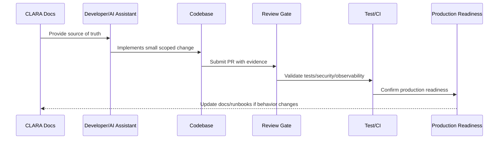

# Stack and Runtime Decisions

> *"Defines how CLARA records stack decisions, runtime versions, package manager choices, framework boundaries, and production compatibility requirements."*

---

# Purpose

Defines how CLARA records stack decisions, runtime versions, package manager choices, framework boundaries, and production compatibility requirements.

---

# Implementation Problem

Unclear stack choices create inconsistent code, dependency drift, build failures, and production incompatibility.

---

# Implementation Decision

## Decision

CLARA stack and runtime decisions should be explicit, versioned, documented, and reviewed before implementation begins.

## Status

Accepted.

---

# Production Implementation Rule

Every CLARA implementation decision should be evaluated against:

```text
correctness
maintainability
security
testability
observability
reliability
operability
developer experience
future change cost
```

A code change is not production-ready if it cannot answer:

```text
what requirement it implements
what module owns it
what inputs it validates
what authorization it enforces
what tests protect it
what logs/metrics help operate it
what failure mode it handles
what documentation it follows
```

---

# Recommended Implementation Flow



---

# Production-Ready Checklist

- [ ] Requirement source is identified.
- [ ] Module ownership is clear.
- [ ] Input validation is implemented.
- [ ] Authorization boundary is enforced.
- [ ] Error handling is safe and explicit.
- [ ] Logs do not expose secrets or sensitive data.
- [ ] Tests cover happy path and important failures.
- [ ] Observability is added where relevant.
- [ ] Documentation/runbook impact is checked.
- [ ] Review gate is passed.

---

# Acceptance Criteria

- [ ] Implementation rule is clear.
- [ ] Security baseline is preserved.
- [ ] Code remains maintainable.
- [ ] Tests and review expectations are clear.
- [ ] AI coding assistants can apply this safely.
- [ ] Production readiness impact is understood.

---

# Anti-patterns

Avoid:

- Coding before reading relevant docs.
- Hard-coding secrets or environment values.
- Mixing business logic into UI/controller layers.
- Skipping authorization because authentication exists.
- Logging raw payloads by default.
- Large unreviewable changes.
- AI-generated code with no tests.
- Bypassing module boundaries.
- Adding dependencies without reason.
- Treating local success as production readiness.

---

# Related Documents

- ../../BOOK-07-Operations-Observability-and-Reliability/BOOK-07-Master-Index/README.md
- ../../BOOK-06-Security-Governance-and-Compliance/BOOK-06-Master-Index/README.md
- ../../BOOK-05-Engineering-Execution-Plan/README.md
- ../../BOOK-03-Architecture-and-Engineering/README.md
- ../../BOOK-04-Data-API-AI-and-Integration-Design/README.md

---

# Navigation

**Previous:** `03-Repository-Strategy.md`

**Next:** `05-Module-Ownership-Model.md`

---

# Stack Decision Record

Every stack decision should define:

```text
technology
version
purpose
owner
alternatives considered
production compatibility
security considerations
operational considerations
upgrade path
decision status
```

---

# Runtime Decisions to Lock

Before implementation, decide:

```text
Node.js/runtime version
package manager
backend framework
frontend framework
database
queue/broker
cache
ORM/query strategy
testing framework
lint/formatter
CI/CD provider
deployment target
observability tools
secret management approach
```

---

# Version Rule

Runtime and tooling versions should be pinned or clearly constrained to reduce build drift.
