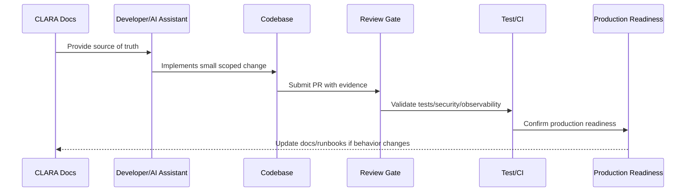

# Module Ownership Model

> *"Defines module ownership, domain boundaries, service responsibilities, dependency direction, and escalation rules for implementation."*

---

# Purpose

Defines module ownership, domain boundaries, service responsibilities, dependency direction, and escalation rules for implementation.

---

# Implementation Problem

Modules without ownership become dumping grounds for unclear logic, duplicated code, and security mistakes.

---

# Implementation Decision

## Decision

Every CLARA module should have clear ownership, responsibility, boundaries, public interfaces, and security expectations.

## Status

Accepted.

---

# Production Implementation Rule

Every CLARA implementation decision should be evaluated against:

```text
correctness
maintainability
security
testability
observability
reliability
operability
developer experience
future change cost
```

A code change is not production-ready if it cannot answer:

```text
what requirement it implements
what module owns it
what inputs it validates
what authorization it enforces
what tests protect it
what logs/metrics help operate it
what failure mode it handles
what documentation it follows
```

---

# Recommended Implementation Flow



---

# Production-Ready Checklist

- [ ] Requirement source is identified.
- [ ] Module ownership is clear.
- [ ] Input validation is implemented.
- [ ] Authorization boundary is enforced.
- [ ] Error handling is safe and explicit.
- [ ] Logs do not expose secrets or sensitive data.
- [ ] Tests cover happy path and important failures.
- [ ] Observability is added where relevant.
- [ ] Documentation/runbook impact is checked.
- [ ] Review gate is passed.

---

# Acceptance Criteria

- [ ] Implementation rule is clear.
- [ ] Security baseline is preserved.
- [ ] Code remains maintainable.
- [ ] Tests and review expectations are clear.
- [ ] AI coding assistants can apply this safely.
- [ ] Production readiness impact is understood.

---

# Anti-patterns

Avoid:

- Coding before reading relevant docs.
- Hard-coding secrets or environment values.
- Mixing business logic into UI/controller layers.
- Skipping authorization because authentication exists.
- Logging raw payloads by default.
- Large unreviewable changes.
- AI-generated code with no tests.
- Bypassing module boundaries.
- Adding dependencies without reason.
- Treating local success as production readiness.

---

# Related Documents

- ../../BOOK-07-Operations-Observability-and-Reliability/BOOK-07-Master-Index/README.md
- ../../BOOK-06-Security-Governance-and-Compliance/BOOK-06-Master-Index/README.md
- ../../BOOK-05-Engineering-Execution-Plan/README.md
- ../../BOOK-03-Architecture-and-Engineering/README.md
- ../../BOOK-04-Data-API-AI-and-Integration-Design/README.md

---

# Navigation

**Previous:** `04-Stack-and-Runtime-Decisions.md`

**Next:** `06-Coding-Standards.md`

---

# Module Ownership Record

```markdown
## Module Ownership

Module:
Domain:
Purpose:
Owner:
Backup owner:
Public interface:
Data owned:
Dependencies:
Security boundary:
Tests required:
Runbook:
```

---

# Module Boundary Rules

```text
domain logic belongs in domain/application layer
controllers should be thin
UI should not own business rules
shared packages should not depend on apps
integration adapters should isolate provider-specific logic
AI Gateway should isolate provider/model behavior
security checks should be explicit and testable
```

---

# Ownership Rule

No production module should exist without owner, responsibility, and dependency direction.
