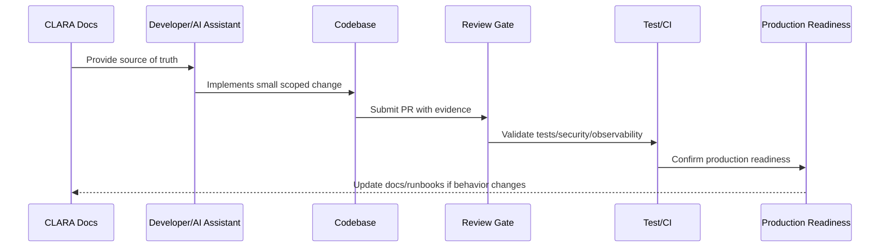

# Coding Standards

> *"Defines CLARA coding standards for readability, naming, error handling, logging, validation, testing, layering, and maintainability."*

---

# Purpose

Defines CLARA coding standards for readability, naming, error handling, logging, validation, testing, layering, and maintainability.

---

# Implementation Problem

Inconsistent coding style makes code review harder and increases production bug risk.

---

# Implementation Decision

## Decision

CLARA code should be easy to read, easy to test, safe to change, and consistent across backend, frontend, workers, AI, and integrations.

## Status

Accepted.

---

# Production Implementation Rule

Every CLARA implementation decision should be evaluated against:

```text
correctness
maintainability
security
testability
observability
reliability
operability
developer experience
future change cost
```

A code change is not production-ready if it cannot answer:

```text
what requirement it implements
what module owns it
what inputs it validates
what authorization it enforces
what tests protect it
what logs/metrics help operate it
what failure mode it handles
what documentation it follows
```

---

# Recommended Implementation Flow



---

# Production-Ready Checklist

- [ ] Requirement source is identified.
- [ ] Module ownership is clear.
- [ ] Input validation is implemented.
- [ ] Authorization boundary is enforced.
- [ ] Error handling is safe and explicit.
- [ ] Logs do not expose secrets or sensitive data.
- [ ] Tests cover happy path and important failures.
- [ ] Observability is added where relevant.
- [ ] Documentation/runbook impact is checked.
- [ ] Review gate is passed.

---

# Acceptance Criteria

- [ ] Implementation rule is clear.
- [ ] Security baseline is preserved.
- [ ] Code remains maintainable.
- [ ] Tests and review expectations are clear.
- [ ] AI coding assistants can apply this safely.
- [ ] Production readiness impact is understood.

---

# Anti-patterns

Avoid:

- Coding before reading relevant docs.
- Hard-coding secrets or environment values.
- Mixing business logic into UI/controller layers.
- Skipping authorization because authentication exists.
- Logging raw payloads by default.
- Large unreviewable changes.
- AI-generated code with no tests.
- Bypassing module boundaries.
- Adding dependencies without reason.
- Treating local success as production readiness.

---

# Related Documents

- ../../BOOK-07-Operations-Observability-and-Reliability/BOOK-07-Master-Index/README.md
- ../../BOOK-06-Security-Governance-and-Compliance/BOOK-06-Master-Index/README.md
- ../../BOOK-05-Engineering-Execution-Plan/README.md
- ../../BOOK-03-Architecture-and-Engineering/README.md
- ../../BOOK-04-Data-API-AI-and-Integration-Design/README.md

---

# Navigation

**Previous:** `05-Module-Ownership-Model.md`

**Next:** `07-Secure-Coding-Baseline.md`

---

# Coding Standards

CLARA code should use:

```text
clear names
small functions
explicit errors
typed contracts where available
input validation at boundaries
authorization checks before sensitive actions
safe logging
consistent formatting
focused tests
minimal dependencies
```

---

# Layering Baseline

Recommended flow:

```text
Controller/Route -> Validator -> Application Service -> Domain Logic -> Repository/Adapter
```

UI/client flow:

```text
View/Component -> State/Hook -> API Client -> Backend Contract
```

---

# Error Handling Rule

Errors should be:

```text
safe for users
useful for operators
not leaking secrets
mapped to appropriate status codes
logged with correlation IDs
```

---

# Maintainability Rule

Prefer boring, readable code over clever abstractions.
