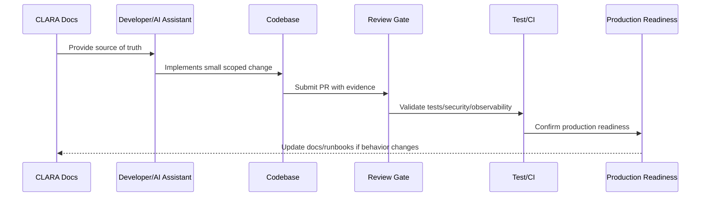

# Secure Coding Baseline

> *"Defines the minimum secure coding baseline for authentication, authorization, input validation, output encoding, injection prevention, secret handling, logging, and dependency safety."*

---

# Purpose

Defines the minimum secure coding baseline for authentication, authorization, input validation, output encoding, injection prevention, secret handling, logging, and dependency safety.

---

# Implementation Problem

Security issues are cheaper to prevent during implementation than to fix after incident or audit.

---

# Implementation Decision

## Decision

CLARA implementation should be secure by default and reject unsafe shortcuts before they reach production.

## Status

Accepted.

---

# Production Implementation Rule

Every CLARA implementation decision should be evaluated against:

```text
correctness
maintainability
security
testability
observability
reliability
operability
developer experience
future change cost
```

A code change is not production-ready if it cannot answer:

```text
what requirement it implements
what module owns it
what inputs it validates
what authorization it enforces
what tests protect it
what logs/metrics help operate it
what failure mode it handles
what documentation it follows
```

---

# Recommended Implementation Flow



---

# Production-Ready Checklist

- [ ] Requirement source is identified.
- [ ] Module ownership is clear.
- [ ] Input validation is implemented.
- [ ] Authorization boundary is enforced.
- [ ] Error handling is safe and explicit.
- [ ] Logs do not expose secrets or sensitive data.
- [ ] Tests cover happy path and important failures.
- [ ] Observability is added where relevant.
- [ ] Documentation/runbook impact is checked.
- [ ] Review gate is passed.

---

# Acceptance Criteria

- [ ] Implementation rule is clear.
- [ ] Security baseline is preserved.
- [ ] Code remains maintainable.
- [ ] Tests and review expectations are clear.
- [ ] AI coding assistants can apply this safely.
- [ ] Production readiness impact is understood.

---

# Anti-patterns

Avoid:

- Coding before reading relevant docs.
- Hard-coding secrets or environment values.
- Mixing business logic into UI/controller layers.
- Skipping authorization because authentication exists.
- Logging raw payloads by default.
- Large unreviewable changes.
- AI-generated code with no tests.
- Bypassing module boundaries.
- Adding dependencies without reason.
- Treating local success as production readiness.

---

# Related Documents

- ../../BOOK-07-Operations-Observability-and-Reliability/BOOK-07-Master-Index/README.md
- ../../BOOK-06-Security-Governance-and-Compliance/BOOK-06-Master-Index/README.md
- ../../BOOK-05-Engineering-Execution-Plan/README.md
- ../../BOOK-03-Architecture-and-Engineering/README.md
- ../../BOOK-04-Data-API-AI-and-Integration-Design/README.md

---

# Navigation

**Previous:** `06-Coding-Standards.md`

**Next:** `08-Environment-and-Configuration-Baseline.md`

---

# Secure Coding Baseline

Minimum rules:

```text
validate all external input
authorize every sensitive action
use parameterized queries
escape/encode output where relevant
protect against XSS/CSRF/SSRF/RCE as applicable
never hard-code secrets
never log secrets
rate-limit abuse-prone endpoints
use secure session/token handling
check dependency risk
separate tenant/workspace data
```

---

# Common Risks to Prevent

```text
SQL/NoSQL injection
XSS
CSRF
SSRF
RCE
broken access control
IDOR
credential leakage
insecure direct file access
unsafe deserialization
excessive data exposure
```

---

# Authorization Rule

Authentication answers “who are you?”

Authorization answers “are you allowed to do this?”

CLARA must implement both.
