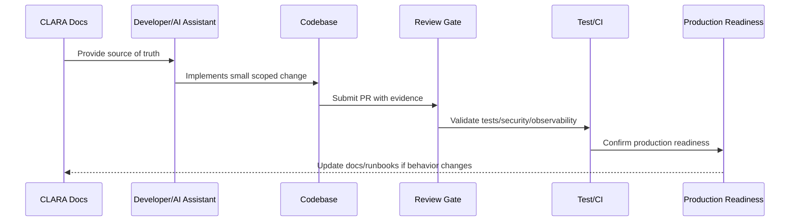

# Environment and Configuration Baseline

> *"Defines CLARA environment strategy, configuration rules, secret handling, feature flags, local/staging/production separation, and safe defaults."*

---

# Purpose

Defines CLARA environment strategy, configuration rules, secret handling, feature flags, local/staging/production separation, and safe defaults.

---

# Implementation Problem

Environment confusion causes bugs, data leaks, failed deployments, and unsafe production behavior.

---

# Implementation Decision

## Decision

CLARA environments and configuration should be explicit, isolated, secure, reproducible, and compatible with deployment automation.

## Status

Accepted.

---

# Production Implementation Rule

Every CLARA implementation decision should be evaluated against:

```text
correctness
maintainability
security
testability
observability
reliability
operability
developer experience
future change cost
```

A code change is not production-ready if it cannot answer:

```text
what requirement it implements
what module owns it
what inputs it validates
what authorization it enforces
what tests protect it
what logs/metrics help operate it
what failure mode it handles
what documentation it follows
```

---

# Recommended Implementation Flow



---

# Production-Ready Checklist

- [ ] Requirement source is identified.
- [ ] Module ownership is clear.
- [ ] Input validation is implemented.
- [ ] Authorization boundary is enforced.
- [ ] Error handling is safe and explicit.
- [ ] Logs do not expose secrets or sensitive data.
- [ ] Tests cover happy path and important failures.
- [ ] Observability is added where relevant.
- [ ] Documentation/runbook impact is checked.
- [ ] Review gate is passed.

---

# Acceptance Criteria

- [ ] Implementation rule is clear.
- [ ] Security baseline is preserved.
- [ ] Code remains maintainable.
- [ ] Tests and review expectations are clear.
- [ ] AI coding assistants can apply this safely.
- [ ] Production readiness impact is understood.

---

# Anti-patterns

Avoid:

- Coding before reading relevant docs.
- Hard-coding secrets or environment values.
- Mixing business logic into UI/controller layers.
- Skipping authorization because authentication exists.
- Logging raw payloads by default.
- Large unreviewable changes.
- AI-generated code with no tests.
- Bypassing module boundaries.
- Adding dependencies without reason.
- Treating local success as production readiness.

---

# Related Documents

- ../../BOOK-07-Operations-Observability-and-Reliability/BOOK-07-Master-Index/README.md
- ../../BOOK-06-Security-Governance-and-Compliance/BOOK-06-Master-Index/README.md
- ../../BOOK-05-Engineering-Execution-Plan/README.md
- ../../BOOK-03-Architecture-and-Engineering/README.md
- ../../BOOK-04-Data-API-AI-and-Integration-Design/README.md

---

# Navigation

**Previous:** `07-Secure-Coding-Baseline.md`

**Next:** `09-Local-Development-Baseline.md`

---

# Environment Types

Recommended:

```text
local
test
development/shared dev
staging
production
sandbox/demo where needed
```

---

# Configuration Rules

```text
configuration comes from environment or config service
secrets come from secret manager or secure local .env example pattern
.env files with real secrets are not committed
production debug mode is disabled
environment-specific behavior is explicit
feature flags are documented
dangerous defaults fail closed
```

---

# Required Config Inventory

Track:

```text
name
purpose
environment
required/optional
default value if safe
secret or non-secret
owner
rotation requirement
```

---

# Environment Rule

Local development must never require production credentials.
