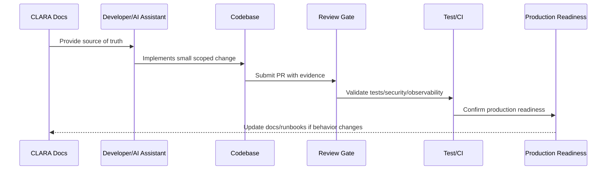

# Local Development Baseline

> *"Defines the minimum local development setup, developer workflow, local services, environment files, test commands, seed data, and safety boundaries."*

---

# Purpose

Defines the minimum local development setup, developer workflow, local services, environment files, test commands, seed data, and safety boundaries.

---

# Implementation Problem

Developers move faster and safer when local setup is reproducible and clearly separated from production.

---

# Implementation Decision

## Decision

CLARA local development should be easy to bootstrap, secure by default, and isolated from production systems.

## Status

Accepted.

---

# Production Implementation Rule

Every CLARA implementation decision should be evaluated against:

```text
correctness
maintainability
security
testability
observability
reliability
operability
developer experience
future change cost
```

A code change is not production-ready if it cannot answer:

```text
what requirement it implements
what module owns it
what inputs it validates
what authorization it enforces
what tests protect it
what logs/metrics help operate it
what failure mode it handles
what documentation it follows
```

---

# Recommended Implementation Flow



---

# Production-Ready Checklist

- [ ] Requirement source is identified.
- [ ] Module ownership is clear.
- [ ] Input validation is implemented.
- [ ] Authorization boundary is enforced.
- [ ] Error handling is safe and explicit.
- [ ] Logs do not expose secrets or sensitive data.
- [ ] Tests cover happy path and important failures.
- [ ] Observability is added where relevant.
- [ ] Documentation/runbook impact is checked.
- [ ] Review gate is passed.

---

# Acceptance Criteria

- [ ] Implementation rule is clear.
- [ ] Security baseline is preserved.
- [ ] Code remains maintainable.
- [ ] Tests and review expectations are clear.
- [ ] AI coding assistants can apply this safely.
- [ ] Production readiness impact is understood.

---

# Anti-patterns

Avoid:

- Coding before reading relevant docs.
- Hard-coding secrets or environment values.
- Mixing business logic into UI/controller layers.
- Skipping authorization because authentication exists.
- Logging raw payloads by default.
- Large unreviewable changes.
- AI-generated code with no tests.
- Bypassing module boundaries.
- Adding dependencies without reason.
- Treating local success as production readiness.

---

# Related Documents

- ../../BOOK-07-Operations-Observability-and-Reliability/BOOK-07-Master-Index/README.md
- ../../BOOK-06-Security-Governance-and-Compliance/BOOK-06-Master-Index/README.md
- ../../BOOK-05-Engineering-Execution-Plan/README.md
- ../../BOOK-03-Architecture-and-Engineering/README.md
- ../../BOOK-04-Data-API-AI-and-Integration-Design/README.md

---

# Navigation

**Previous:** `08-Environment-and-Configuration-Baseline.md`

**Next:** `10-Implementation-Review-Gates.md`

---

# Local Development Goals

Local setup should be:

```text
easy to bootstrap
documented
repeatable
isolated from production
safe with fake/test data
compatible with tests
compatible with AI coding assistant workflows
```

---

# Local Setup Checklist

- [ ] Runtime installed.
- [ ] Package manager installed.
- [ ] Dependencies install cleanly.
- [ ] Environment example exists.
- [ ] Database can run locally or through dev container.
- [ ] Migrations can run.
- [ ] Seed data exists.
- [ ] Tests can run.
- [ ] Lint/format commands work.
- [ ] No production credentials required.

---

# Suggested Commands

```bash
cp .env.example .env
pnpm install
pnpm db:migrate
pnpm db:seed
pnpm dev
pnpm test
pnpm lint
```

---

# Local Safety Rule

Use fake providers/mocks for risky external systems until approved integration environments exist.
