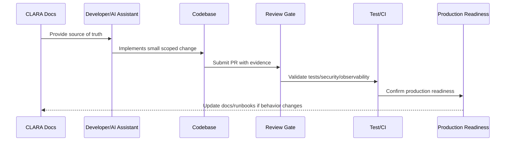

# AI Coding Assistant Guidelines

> *"Defines how Codex, Cursor, and other AI coding assistants should work inside the CLARA repository while respecting documentation, security, tests, and architecture boundaries."*

---

# Purpose

Defines how Codex, Cursor, and other AI coding assistants should work inside the CLARA repository while respecting documentation, security, tests, and architecture boundaries.

---

# Implementation Problem

AI coding assistants can accelerate implementation but can also introduce insecure, inconsistent, or undocumented code if not guided.

---

# Implementation Decision

## Decision

AI coding assistants should follow CLARA docs as source of truth, make small safe changes, preserve boundaries, and never invent security-sensitive behavior without review.

## Status

Accepted.

---

# Production Implementation Rule

Every CLARA implementation decision should be evaluated against:

```text
correctness
maintainability
security
testability
observability
reliability
operability
developer experience
future change cost
```

A code change is not production-ready if it cannot answer:

```text
what requirement it implements
what module owns it
what inputs it validates
what authorization it enforces
what tests protect it
what logs/metrics help operate it
what failure mode it handles
what documentation it follows
```

---

# Recommended Implementation Flow



---

# Production-Ready Checklist

- [ ] Requirement source is identified.
- [ ] Module ownership is clear.
- [ ] Input validation is implemented.
- [ ] Authorization boundary is enforced.
- [ ] Error handling is safe and explicit.
- [ ] Logs do not expose secrets or sensitive data.
- [ ] Tests cover happy path and important failures.
- [ ] Observability is added where relevant.
- [ ] Documentation/runbook impact is checked.
- [ ] Review gate is passed.

---

# Acceptance Criteria

- [ ] Implementation rule is clear.
- [ ] Security baseline is preserved.
- [ ] Code remains maintainable.
- [ ] Tests and review expectations are clear.
- [ ] AI coding assistants can apply this safely.
- [ ] Production readiness impact is understood.

---

# Anti-patterns

Avoid:

- Coding before reading relevant docs.
- Hard-coding secrets or environment values.
- Mixing business logic into UI/controller layers.
- Skipping authorization because authentication exists.
- Logging raw payloads by default.
- Large unreviewable changes.
- AI-generated code with no tests.
- Bypassing module boundaries.
- Adding dependencies without reason.
- Treating local success as production readiness.

---

# Related Documents

- ../../BOOK-07-Operations-Observability-and-Reliability/BOOK-07-Master-Index/README.md
- ../../BOOK-06-Security-Governance-and-Compliance/BOOK-06-Master-Index/README.md
- ../../BOOK-05-Engineering-Execution-Plan/README.md
- ../../BOOK-03-Architecture-and-Engineering/README.md
- ../../BOOK-04-Data-API-AI-and-Integration-Design/README.md

---

# Navigation

**Previous:** `10-Implementation-Review-Gates.md`

**Next:** `12-Part-01-Summary.md`

---

# AI Coding Assistant Operating Rules

AI assistants working on CLARA must:

```text
read relevant docs first
make small scoped changes
preserve module boundaries
prefer existing patterns
write tests with code changes
avoid inventing APIs/contracts
avoid hard-coded secrets
avoid broad refactors without request
explain security-sensitive changes
update docs if behavior changes
```

---

# Recommended AGENTS.md Baseline

```markdown
# AGENTS.md

You are working on CLARA.

Before coding:
1. Read docs relevant to the module.
2. Preserve architecture and security boundaries.
3. Make small, reviewable changes.
4. Add or update tests.
5. Do not hard-code secrets.
6. Do not log sensitive data.
7. Validate input at boundaries.
8. Enforce authorization before sensitive actions.
9. Prefer simple maintainable code.
10. Update documentation when behavior changes.
```

---

# AI Safety Rule

AI-generated code is not trusted automatically.

It must pass the same review, security, and test gates as human-written code.
