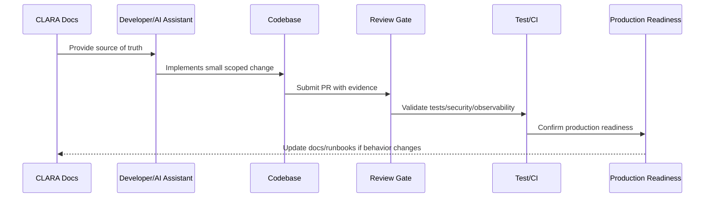

# Part 01 Summary

> *"Summarizes Implementation Foundation and prepares for Book VIII Part 02."*

---

# Purpose

Summarizes Implementation Foundation and prepares for Book VIII Part 02.

---

# Implementation Problem

Repository and module implementation comes next because the foundation must become actual folders, configs, packages, and module boundaries.

---

# Implementation Decision

## Decision

CLARA should proceed to Repository and Module Implementation after defining implementation principles, repo strategy, stack decisions, ownership, coding standards, secure coding, environment baseline, local dev, review gates, and AI assistant guidance.

## Status

Accepted.

---

# Production Implementation Rule

Every CLARA implementation decision should be evaluated against:

```text
correctness
maintainability
security
testability
observability
reliability
operability
developer experience
future change cost
```

A code change is not production-ready if it cannot answer:

```text
what requirement it implements
what module owns it
what inputs it validates
what authorization it enforces
what tests protect it
what logs/metrics help operate it
what failure mode it handles
what documentation it follows
```

---

# Recommended Implementation Flow



---

# Production-Ready Checklist

- [ ] Requirement source is identified.
- [ ] Module ownership is clear.
- [ ] Input validation is implemented.
- [ ] Authorization boundary is enforced.
- [ ] Error handling is safe and explicit.
- [ ] Logs do not expose secrets or sensitive data.
- [ ] Tests cover happy path and important failures.
- [ ] Observability is added where relevant.
- [ ] Documentation/runbook impact is checked.
- [ ] Review gate is passed.

---

# Acceptance Criteria

- [ ] Implementation rule is clear.
- [ ] Security baseline is preserved.
- [ ] Code remains maintainable.
- [ ] Tests and review expectations are clear.
- [ ] AI coding assistants can apply this safely.
- [ ] Production readiness impact is understood.

---

# Anti-patterns

Avoid:

- Coding before reading relevant docs.
- Hard-coding secrets or environment values.
- Mixing business logic into UI/controller layers.
- Skipping authorization because authentication exists.
- Logging raw payloads by default.
- Large unreviewable changes.
- AI-generated code with no tests.
- Bypassing module boundaries.
- Adding dependencies without reason.
- Treating local success as production readiness.

---

# Related Documents

- ../../BOOK-07-Operations-Observability-and-Reliability/BOOK-07-Master-Index/README.md
- ../../BOOK-06-Security-Governance-and-Compliance/BOOK-06-Master-Index/README.md
- ../../BOOK-05-Engineering-Execution-Plan/README.md
- ../../BOOK-03-Architecture-and-Engineering/README.md
- ../../BOOK-04-Data-API-AI-and-Integration-Design/README.md

---

# Navigation

**Previous:** `11-AI-Coding-Assistant-Guidelines.md`

**Next:** `../PART-02-Repository-and-Module-Implementation/README.md`

---

# Part 01 Completion

Part 01 establishes:

- Implementation overview.
- Implementation principles.
- Repository strategy.
- Stack and runtime decisions.
- Module ownership model.
- Coding standards.
- Secure coding baseline.
- Environment and configuration baseline.
- Local development baseline.
- Implementation review gates.
- AI coding assistant guidelines.

---

# Ready for Part 02

The next part should be:

```text
BOOK VIII — PART 02: Repository and Module Implementation
```

It should define:

- Repository skeleton.
- Root documentation files.
- Workspace/package strategy.
- Apps/services/packages layout.
- Backend module structure.
- Frontend module structure.
- Worker module structure.
- Shared package structure.
- Test folder structure.
- Scripts and tooling.
- Initial AGENTS.md files.
