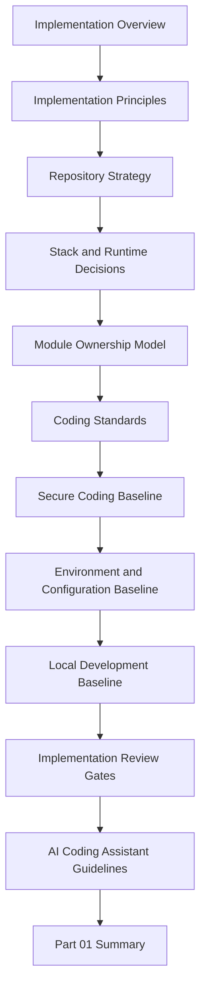

# PART-01 — Implementation Foundation

> *"Production-ready implementation starts before the first production line of code is written."*

---

# Purpose

Part 01 defines CLARA's implementation foundation.

It translates the previous books into practical engineering rules for coding, repository setup, secure defaults, local development, review gates, and AI-assisted implementation.

---

# Chapter Map

| Chapter | Title |
|---:|---|
| 01 | Implementation Overview |
| 02 | Implementation Principles |
| 03 | Repository Strategy |
| 04 | Stack and Runtime Decisions |
| 05 | Module Ownership Model |
| 06 | Coding Standards |
| 07 | Secure Coding Baseline |
| 08 | Environment and Configuration Baseline |
| 09 | Local Development Baseline |
| 10 | Implementation Review Gates |
| 11 | AI Coding Assistant Guidelines |
| 12 | Part 01 Summary |

---

# Implementation Foundation Map



---

# Implementation Non-Negotiables

CLARA implementation must enforce:

```text
documentation-first development
clear repository boundaries
explicit stack/runtime versions
module ownership
secure coding baseline
no hard-coded secrets
input validation
authorization checks
safe logging
testable business logic
environment separation
review gates
AI coding assistant guardrails
production readiness mindset
```

---

# Relationship to Previous Books

Book VIII should always reference:

```text
Book I  -> foundation and philosophy
Book II -> product/domain definition
Book III -> architecture and engineering principles
Book IV -> data, API, AI, and integration contracts
Book V -> execution and delivery planning
Book VI -> security, governance, and compliance
Book VII -> operations, observability, and reliability
```

---

# Navigation

**Previous:** `../BOOK-07-Operations-Observability-and-Reliability/BOOK-07-Master-Index/BOOK-07-NEXT-STEPS.md`

**Next:** `01-Implementation-Overview.md`
