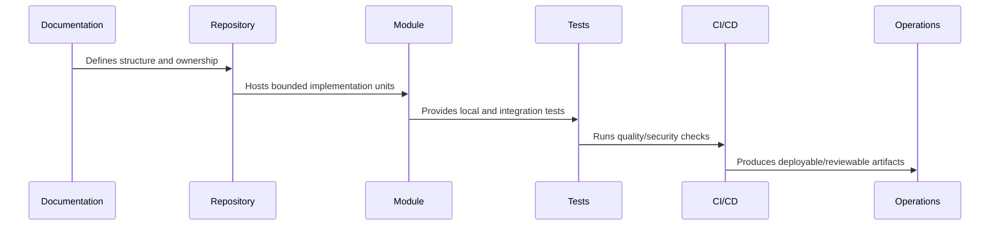

# Repository and Module Implementation Overview

> *"Introduces CLARA's repository and module implementation model for converting implementation principles into an actual maintainable codebase structure."*

---

# Purpose

Introduces CLARA's repository and module implementation model for converting implementation principles into an actual maintainable codebase structure.

---

# Implementation Problem

A codebase without clear structure turns into technical debt quickly, especially when multiple developers and AI coding assistants contribute changes.

---

# Implementation Decision

## Decision

CLARA should implement repository structure and module boundaries before major coding begins so engineering, testing, security, CI/CD, and AI assistants work from the same map.

## Status

Accepted.

---

# Repository Implementation Rule

Every CLARA folder, package, and module should answer:

```text
what it owns
who owns it
what depends on it
what it may import
what it must not import
how it is tested
how it is deployed or consumed
what security boundary it touches
```

A repository structure is not production-ready if:

```text
ownership is unclear
deployable code and shared code are mixed randomly
security-sensitive code has no obvious owner
tests are hard to locate
environment files are inconsistent
AI assistants cannot infer safe boundaries
CI/CD cannot target modules cleanly
```

---

# Recommended Repository Flow



---

# Production-Ready Checklist

- [ ] Folder has clear purpose.
- [ ] Owner is clear.
- [ ] Import direction is clear.
- [ ] Tests are discoverable.
- [ ] Public interface is clear where relevant.
- [ ] Security-sensitive files are protected.
- [ ] Config/secrets rules are documented.
- [ ] CI/CD can target the folder.
- [ ] AI assistant guidance exists where needed.
- [ ] Documentation links to related architecture/security/operations docs.

---

# Acceptance Criteria

- [ ] Repository structure is understandable.
- [ ] Module boundaries are explicit.
- [ ] Shared code has ownership.
- [ ] Tests and tooling are discoverable.
- [ ] Security risks are reduced by structure.
- [ ] Future implementation can proceed safely.

---

# Anti-patterns

Avoid:

- `utils/` becoming a dumping ground.
- Controllers owning business logic.
- UI components calling random internal services directly.
- Shared packages depending on deployable apps.
- Worker jobs mutating data without idempotency.
- Scripts that can accidentally target production.
- Multiple competing environment conventions.
- Tests hidden beside unrelated code with no pattern.
- AI assistant instructions only in chat history, not repository files.
- Committing generated artifacts without reason.

---

# Related Documents

- ../PART-01-Implementation-Foundation/README.md
- ../../BOOK-07-Operations-Observability-and-Reliability/BOOK-07-Master-Index/README.md
- ../../BOOK-06-Security-Governance-and-Compliance/BOOK-06-Master-Index/README.md
- ../../BOOK-04-Data-API-AI-and-Integration-Design/README.md
- ../../BOOK-03-Architecture-and-Engineering/README.md

---

# Navigation

**Previous:** `../PART-01-Implementation-Foundation/12-Part-01-Summary.md`

**Next:** `14-Root-Repository-Skeleton.md`

---

# Implementation Scope

Part 02 covers:

```text
root repository skeleton
root documentation files
workspace and package strategy
apps/services/packages layout
backend modules
frontend/client modules
worker/async modules
shared packages
testing folders
scripts/tooling/automation
AI assistant repo guidance
```

---

# Core Questions

```text
Where does code live?
Where do docs live?
What is deployable?
What is shared?
What owns business logic?
Where do tests live?
How does CI/CD target code?
How do AI assistants know boundaries?
```

---

# Repository Principle

The repository should make the right thing obvious and the risky thing hard.
