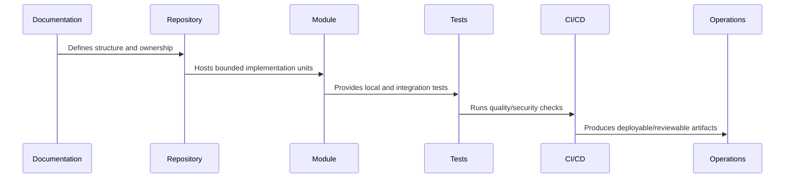

# Root Documentation Files

> *"Defines required root documentation files such as README, AGENTS, SECURITY, CONTRIBUTING, CODEOWNERS, architecture pointers, and local development docs."*

---

# Purpose

Defines required root documentation files such as README, AGENTS, SECURITY, CONTRIBUTING, CODEOWNERS, architecture pointers, and local development docs.

---

# Implementation Problem

Without root documentation, developers and AI assistants repeatedly ask or guess how the repo should be used.

---

# Implementation Decision

## Decision

CLARA should use root documentation files to guide humans and AI assistants toward safe, consistent, documented implementation behavior.

## Status

Accepted.

---

# Repository Implementation Rule

Every CLARA folder, package, and module should answer:

```text
what it owns
who owns it
what depends on it
what it may import
what it must not import
how it is tested
how it is deployed or consumed
what security boundary it touches
```

A repository structure is not production-ready if:

```text
ownership is unclear
deployable code and shared code are mixed randomly
security-sensitive code has no obvious owner
tests are hard to locate
environment files are inconsistent
AI assistants cannot infer safe boundaries
CI/CD cannot target modules cleanly
```

---

# Recommended Repository Flow



---

# Production-Ready Checklist

- [ ] Folder has clear purpose.
- [ ] Owner is clear.
- [ ] Import direction is clear.
- [ ] Tests are discoverable.
- [ ] Public interface is clear where relevant.
- [ ] Security-sensitive files are protected.
- [ ] Config/secrets rules are documented.
- [ ] CI/CD can target the folder.
- [ ] AI assistant guidance exists where needed.
- [ ] Documentation links to related architecture/security/operations docs.

---

# Acceptance Criteria

- [ ] Repository structure is understandable.
- [ ] Module boundaries are explicit.
- [ ] Shared code has ownership.
- [ ] Tests and tooling are discoverable.
- [ ] Security risks are reduced by structure.
- [ ] Future implementation can proceed safely.

---

# Anti-patterns

Avoid:

- `utils/` becoming a dumping ground.
- Controllers owning business logic.
- UI components calling random internal services directly.
- Shared packages depending on deployable apps.
- Worker jobs mutating data without idempotency.
- Scripts that can accidentally target production.
- Multiple competing environment conventions.
- Tests hidden beside unrelated code with no pattern.
- AI assistant instructions only in chat history, not repository files.
- Committing generated artifacts without reason.

---

# Related Documents

- ../PART-01-Implementation-Foundation/README.md
- ../../BOOK-07-Operations-Observability-and-Reliability/BOOK-07-Master-Index/README.md
- ../../BOOK-06-Security-Governance-and-Compliance/BOOK-06-Master-Index/README.md
- ../../BOOK-04-Data-API-AI-and-Integration-Design/README.md
- ../../BOOK-03-Architecture-and-Engineering/README.md

---

# Navigation

**Previous:** `14-Root-Repository-Skeleton.md`

**Next:** `16-Workspace-and-Package-Strategy.md`

---

# Required Root Files

```text
README.md
AGENTS.md
SECURITY.md
CONTRIBUTING.md
CODEOWNERS
.env.example
.gitignore
.editorconfig
package.json
pnpm-workspace.yaml
tsconfig.base.json
```

---

# README.md Should Include

```text
project overview
repo structure
quick start
required tools
local development commands
test commands
documentation links
security reminder
support/ownership links
```

---

# AGENTS.md Should Include

```text
documentation source of truth
coding rules
security rules
test requirements
module boundary rules
forbidden shortcuts
PR expectations
```

---

# SECURITY.md Should Include

```text
reporting path
secret handling rules
vulnerability handling expectations
secure coding baseline reference
production access warning
```

---

# Root Docs Rule

If a developer or AI assistant needs to know it before coding, put it in root docs or link it clearly.
