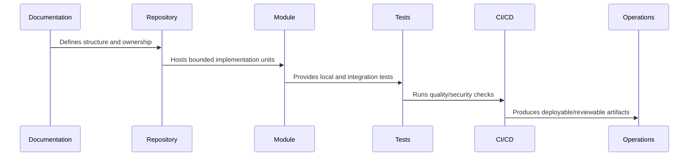

# Workspace and Package Strategy

> *"Defines workspace strategy, package manager assumptions, dependency ownership, internal package naming, version constraints, and package boundary rules."*

---

# Purpose

Defines workspace strategy, package manager assumptions, dependency ownership, internal package naming, version constraints, and package boundary rules.

---

# Implementation Problem

Dependency chaos appears quickly when shared code and package boundaries are not designed early.

---

# Implementation Decision

## Decision

CLARA should use a workspace structure that keeps apps, services, workers, and shared packages consistent while preventing accidental cross-module coupling.

## Status

Accepted.

---

# Repository Implementation Rule

Every CLARA folder, package, and module should answer:

```text
what it owns
who owns it
what depends on it
what it may import
what it must not import
how it is tested
how it is deployed or consumed
what security boundary it touches
```

A repository structure is not production-ready if:

```text
ownership is unclear
deployable code and shared code are mixed randomly
security-sensitive code has no obvious owner
tests are hard to locate
environment files are inconsistent
AI assistants cannot infer safe boundaries
CI/CD cannot target modules cleanly
```

---

# Recommended Repository Flow



---

# Production-Ready Checklist

- [ ] Folder has clear purpose.
- [ ] Owner is clear.
- [ ] Import direction is clear.
- [ ] Tests are discoverable.
- [ ] Public interface is clear where relevant.
- [ ] Security-sensitive files are protected.
- [ ] Config/secrets rules are documented.
- [ ] CI/CD can target the folder.
- [ ] AI assistant guidance exists where needed.
- [ ] Documentation links to related architecture/security/operations docs.

---

# Acceptance Criteria

- [ ] Repository structure is understandable.
- [ ] Module boundaries are explicit.
- [ ] Shared code has ownership.
- [ ] Tests and tooling are discoverable.
- [ ] Security risks are reduced by structure.
- [ ] Future implementation can proceed safely.

---

# Anti-patterns

Avoid:

- `utils/` becoming a dumping ground.
- Controllers owning business logic.
- UI components calling random internal services directly.
- Shared packages depending on deployable apps.
- Worker jobs mutating data without idempotency.
- Scripts that can accidentally target production.
- Multiple competing environment conventions.
- Tests hidden beside unrelated code with no pattern.
- AI assistant instructions only in chat history, not repository files.
- Committing generated artifacts without reason.

---

# Related Documents

- ../PART-01-Implementation-Foundation/README.md
- ../../BOOK-07-Operations-Observability-and-Reliability/BOOK-07-Master-Index/README.md
- ../../BOOK-06-Security-Governance-and-Compliance/BOOK-06-Master-Index/README.md
- ../../BOOK-04-Data-API-AI-and-Integration-Design/README.md
- ../../BOOK-03-Architecture-and-Engineering/README.md

---

# Navigation

**Previous:** `15-Root-Documentation-Files.md`

**Next:** `17-Apps-Services-and-Packages-Layout.md`

---

# Workspace Strategy

Recommended workspace groups:

```text
apps/*
services/*
workers/*
packages/*
tools/*
```

Example:

```yaml
packages:
  - "apps/*"
  - "services/*"
  - "workers/*"
  - "packages/*"
  - "tools/*"
```

---

# Internal Package Naming

Use consistent scoped names:

```text
@clara/contracts
@clara/config
@clara/logger
@clara/observability
@clara/security
@clara/database
@clara/ui
@clara/test-utils
```

---

# Dependency Direction

```text
apps/services/workers -> packages
packages -> packages
packages must not depend on apps/services/workers
domain packages should avoid infrastructure dependencies
```

---

# Dependency Rule

Shared packages should reduce duplication, not hide ownership.
