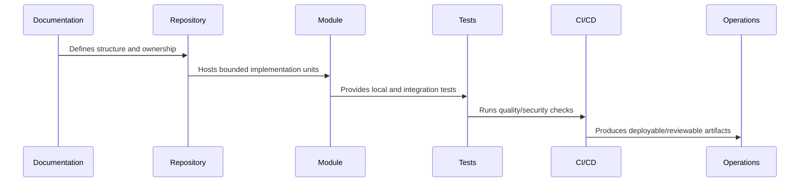

# Backend Module Structure

> *"Defines backend module structure for routes/controllers, validators, application services, domain logic, repositories, adapters, policies, tests, and observability."*

---

# Purpose

Defines backend module structure for routes/controllers, validators, application services, domain logic, repositories, adapters, policies, tests, and observability.

---

# Implementation Problem

Backend code becomes fragile when controllers contain business logic, repositories contain authorization, or adapters leak provider-specific behavior everywhere.

---

# Implementation Decision

## Decision

CLARA backend modules should follow layered boundaries that keep business logic testable, authorization explicit, and provider/database code isolated.

## Status

Accepted.

---

# Repository Implementation Rule

Every CLARA folder, package, and module should answer:

```text
what it owns
who owns it
what depends on it
what it may import
what it must not import
how it is tested
how it is deployed or consumed
what security boundary it touches
```

A repository structure is not production-ready if:

```text
ownership is unclear
deployable code and shared code are mixed randomly
security-sensitive code has no obvious owner
tests are hard to locate
environment files are inconsistent
AI assistants cannot infer safe boundaries
CI/CD cannot target modules cleanly
```

---

# Recommended Repository Flow



---

# Production-Ready Checklist

- [ ] Folder has clear purpose.
- [ ] Owner is clear.
- [ ] Import direction is clear.
- [ ] Tests are discoverable.
- [ ] Public interface is clear where relevant.
- [ ] Security-sensitive files are protected.
- [ ] Config/secrets rules are documented.
- [ ] CI/CD can target the folder.
- [ ] AI assistant guidance exists where needed.
- [ ] Documentation links to related architecture/security/operations docs.

---

# Acceptance Criteria

- [ ] Repository structure is understandable.
- [ ] Module boundaries are explicit.
- [ ] Shared code has ownership.
- [ ] Tests and tooling are discoverable.
- [ ] Security risks are reduced by structure.
- [ ] Future implementation can proceed safely.

---

# Anti-patterns

Avoid:

- `utils/` becoming a dumping ground.
- Controllers owning business logic.
- UI components calling random internal services directly.
- Shared packages depending on deployable apps.
- Worker jobs mutating data without idempotency.
- Scripts that can accidentally target production.
- Multiple competing environment conventions.
- Tests hidden beside unrelated code with no pattern.
- AI assistant instructions only in chat history, not repository files.
- Committing generated artifacts without reason.

---

# Related Documents

- ../PART-01-Implementation-Foundation/README.md
- ../../BOOK-07-Operations-Observability-and-Reliability/BOOK-07-Master-Index/README.md
- ../../BOOK-06-Security-Governance-and-Compliance/BOOK-06-Master-Index/README.md
- ../../BOOK-04-Data-API-AI-and-Integration-Design/README.md
- ../../BOOK-03-Architecture-and-Engineering/README.md

---

# Navigation

**Previous:** `17-Apps-Services-and-Packages-Layout.md`

**Next:** `19-Frontend-and-Client-Module-Structure.md`

---

# Backend Module Structure

Recommended module pattern:

```text
services/api/src/modules/<module-name>/
├── routes/
├── controllers/
├── validators/
├── application/
├── domain/
├── repositories/
├── adapters/
├── policies/
├── events/
├── dto/
├── tests/
└── index.ts
```

---

# Layer Responsibilities

| Layer | Responsibility |
|---|---|
| routes/controllers | HTTP boundary and request handling |
| validators | input validation and parsing |
| application | use cases/orchestration |
| domain | business rules/entities/value objects |
| repositories | persistence interface/implementation |
| adapters | external systems/providers |
| policies | authorization/business policy checks |
| events | domain/application events |
| dto | request/response shapes |

---

# Backend Security Rule

Authorization must be explicit near application/service boundary.

Do not rely on UI hiding buttons as access control.
